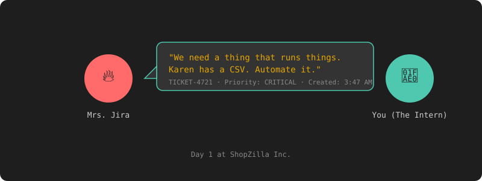

# Chapter 0: Before You Start

[Chapter 1: Your First Day →](chapter-01-first-day.md)

---

## The Story

This is a series about building a job engine in Java — but not the kind where you memorize "`ExecutorService` has a thread pool" and move on.

You're an intern at **ShopZilla Inc.**, a chaotic e-commerce company where everything is on fire. Your manager, Mrs. Jira, creates tickets faster than your code compiles. The CTO, Captain Deadline, only speaks in "we need this yesterday." The senior dev, Old Greg, hasn't merged a PR since 2019 but has opinions about everything.

Day one, Mrs. Jira walks over and says:

"We need a thing that runs things. Karen from Sales has a 50,000-row CSV she needs imported every morning. Right now someone runs a Python script manually. Can you automate it?"

You say yes. You have no idea what's coming.



Over the next 9 chapters, you'll build a job engine from scratch — the kind that imports CSVs, resizes product images, calculates prices against a live exchange-rate API, and sends batch emails. It'll work perfectly on your laptop. Then you'll deploy it, and everything will break.

Karen gets duplicate products. The image resizer corrupts files. The exchange-rate API bans your IP. A job runs for 45 minutes and nobody can stop it. Black Friday crashes the server. Someone cancels 12,000 jobs and nobody knows who.

Each incident teaches you something about concurrency, failure handling, or distributed systems that no textbook could. You'll fix every bug, write a test that proves the fix, and ship it.

By the end, you'll have a production-grade engine with threading, backpressure, priority queues, fork/join, caching, retries, DAG scheduling, distributed locking, audit trails, and graceful shutdown — and you'll understand *why* every line of code is there.

## How to Read This

Every chapter is the same loop:

1. Something breaks — Karen sends an angry email, Captain Deadline calls a war room
2. You write a test that reproduces the bug
3. You figure out why it happened
4. You fix it
5. The test goes green

No concept shows up before you need it. You won't hear about `Semaphore` until the exchange-rate API bans your IP for sending 5 concurrent requests. You won't touch `PriorityBlockingQueue` until Karen's CRITICAL import sits behind an intern's LOW job for 15 minutes.

The bugs come first. The theory follows.

## The Cast

| Character | Role | Personality |
|---|---|---|
| **You** | The Intern | Eager, slightly terrified |
| **Mrs. Jira** | Product Manager | Fires tickets at 3am. "Just a small change." |
| **Captain Deadline** | CTO | Every sprint is a "war room." Loves Grafana. |
| **Old Greg** | Senior Dev | Reviews your PR 3 weeks later. "Why not use Semaphores?" |
| **Karen from Sales** | Stakeholder | "The CSV has 50,000 rows and I need it NOW." |
| **Silent Bob** | DevOps | Never speaks. Fixes prod at 2am. Communicates via Slack emoji. |
| **The Phantom** | That one stuck job | Running since Tuesday. No one knows what it does. |

## The Roadmap

| Ch | The Incident | What You Learn |
|---|---|---|
| 1 | You build the engine | Project setup, naive single-threaded runner |
| 2 | Karen gets duplicate products | Race conditions → `SELECT FOR UPDATE SKIP LOCKED`, `AtomicInteger` |
| 3 | The exchange-rate API bans your IP | Thread pools, semaphores, priority queues, backpressure |
| 4 | Karen's CSV takes 10 minutes | Fork/join, virtual threads, Redis caching |
| 5 | The API goes down, all jobs fail | Retries, exponential backoff, dead-letter queue, heartbeats |
| 6 | Karen imports the wrong file | Cancel, pause, resume, checkpointing |
| 7 | Captain Deadline wants a nightly pipeline | DAG dependencies, topological sort, cascade failure |
| 8 | Silent Bob deploys 3 copies | Distributed locking, leader election, job affinity |
| 9 | Someone cancels 12,000 jobs | JWT auth, role-based access, audit trail, rate limiting |

## Prerequisites

Three things: Java 21, Gradle, and a terminal.

### Java 21 (Amazon Corretto)

```bash
curl -LO https://corretto.aws/downloads/latest/amazon-corretto-21-x64-linux-jdk.tar.gz
tar -xzf amazon-corretto-21-x64-linux-jdk.tar.gz
sudo mkdir -p /usr/lib/jvm
sudo mv amazon-corretto-21.* /usr/lib/jvm/corretto-21
export JAVA_HOME=/usr/lib/jvm/corretto-21
export PATH=$JAVA_HOME/bin:$PATH
```

Add the `export` lines to your `~/.bashrc` or `~/.zshrc` to make it permanent.

We need Java 21 specifically for virtual threads (Project Loom). You'll use them in Chapter 4 when Captain Deadline asks "can we handle 1,000 concurrent jobs?"

Verify:

```bash
java -version
```

```
openjdk version "21.0.x" ...
```

### Gradle

You don't need to install Gradle globally — the project includes a wrapper (`gradlew`) that downloads it automatically. But if you want it:

```bash
sdk install gradle
```

### PostgreSQL + Redis

You'll need both by Chapter 2. The easiest way:

```bash
docker run -d --name shopzilla-pg -p 5432:5432 \
  -e POSTGRES_DB=jobengine -e POSTGRES_PASSWORD=shopzilla \
  postgres:16

docker run -d --name shopzilla-redis -p 6379:6379 redis:7
```

### IDE (Optional)

Any text editor works. IntelliJ IDEA or VS Code recommended but not required.

### Quick Check

```bash
java -version && echo "---" && docker ps
```

If Java prints a version and you see the Postgres + Redis containers, you're good.

Let's build the engine.

---

[Chapter 1: Your First Day →](chapter-01-first-day.md)
