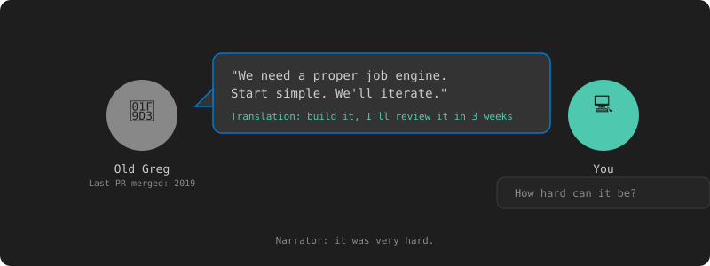
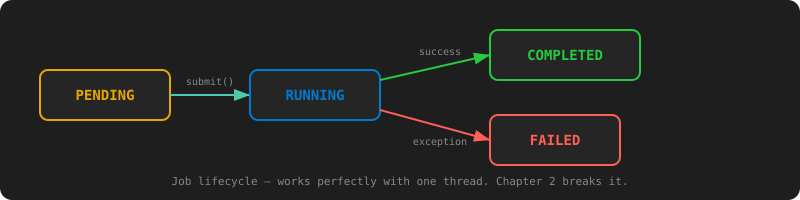
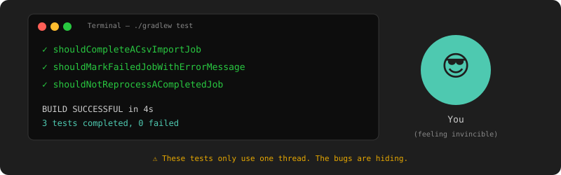

# Chapter 1: Your First Day — Build the Engine

[← Chapter 0: Prerequisites](chapter-00-prerequisites.md) | [Chapter 2: Karen Gets Duplicate Products →](chapter-02-multithreading.md)

---

## The Task

It's your first week as an intern at ShopZilla Inc. The team processes CSV imports, resizes product images, recalculates prices — all as background jobs. Right now they're using a tangled mess of cron scripts and Karen manually running a Python script every morning.

Your tech lead, Old Greg — yes, everyone calls him that, and yes, he reviews every PR like it's a kernel patch — walks over to your desk.

"We need a proper job engine. Something that accepts jobs and runs them. Start simple — we'll iterate. Think you can handle it?"

You nod. How hard can it be?



You grab a coffee, open your laptop, and start typing.

## Initialize the Project

```bash
mkdir job-engine && cd job-engine
```

Create `build.gradle`:

```groovy
plugins {
    id 'java'
    id 'org.springframework.boot' version '3.4.1'
    id 'io.spring.dependency-management' version '1.1.7'
}

group = 'com.shopzilla'
version = '1.0.0'

java {
    toolchain {
        languageVersion = JavaLanguageVersion.of(21)
    }
}

repositories {
    mavenCentral()
}

dependencies {
    implementation 'org.springframework.boot:spring-boot-starter-web'
    implementation 'org.springframework.boot:spring-boot-starter-data-jpa'
    implementation 'org.springframework.boot:spring-boot-starter-validation'
    runtimeOnly 'org.postgresql:postgresql'
    testImplementation 'org.springframework.boot:spring-boot-starter-test'
    testRuntimeOnly 'com.h2database:h2'
    testRuntimeOnly 'org.junit.platform:junit-platform-launcher'
}

tasks.named('test') {
    useJUnitPlatform()
}
```

And `settings.gradle`:

```groovy
rootProject.name = 'job-engine'
```

Generate the Gradle wrapper:

```bash
gradle wrapper
```

This creates `gradlew`, `gradlew.bat`, and the `gradle/wrapper/` directory. From here on, use `./gradlew` instead of `gradle`.

Add a `.gitignore`:

```
.gradle/
build/
!gradle/wrapper/gradle-wrapper.jar
.idea/
*.iml
.vscode/
.DS_Store
```

Spring Boot is just the container — the engine itself is pure Java. Wire up the main class and move on to the real work.

```java
// src/main/java/com/shopzilla/JobEngineApplication.java
package com.shopzilla;

import org.springframework.boot.SpringApplication;
import org.springframework.boot.autoconfigure.SpringBootApplication;
import org.springframework.scheduling.annotation.EnableScheduling;

@SpringBootApplication
@EnableScheduling
public class JobEngineApplication {
    public static void main(String[] args) {
        SpringApplication.run(JobEngineApplication.class, args);
    }
}
```

Alright, scaffolding done. Time to build the thing Old Greg actually asked for.

## The Job Model

A job needs four things: an identity, a type, a payload, and a status. That's it. No priority, no timeout, no dependencies — Old Greg said start simple.

### Status

A job is either waiting to run, running, done, or broken.

```java
// src/main/java/com/shopzilla/model/JobStatus.java
package com.shopzilla.model;

public enum JobStatus {
    PENDING,
    RUNNING,
    COMPLETED,
    FAILED
}
```

Four states. We'll add more later when things break.

### The Job Entity

```java
// src/main/java/com/shopzilla/model/Job.java
package com.shopzilla.model;

import jakarta.persistence.*;
import java.time.Instant;

@Entity
@Table(name = "jobs")
public class Job {

    @Id
    @GeneratedValue(strategy = GenerationType.UUID)
    private String id;

    private String type;

    @Column(columnDefinition = "TEXT")
    private String payload;

    // ⚠️ BUG: plain enum field — no thread safety
    @Enumerated(EnumType.STRING)
    private JobStatus status = JobStatus.PENDING;

    @Column(columnDefinition = "TEXT")
    private String result;

    @Column(columnDefinition = "TEXT")
    private String errorMessage;

    private Instant createdAt;
    private Instant updatedAt;

    protected Job() {}

    public Job(String type, String payload) {
        this.type = type;
        this.payload = payload;
        this.createdAt = Instant.now();
        this.updatedAt = Instant.now();
    }

    // ⚠️ BUG: check-then-act is NOT atomic
    public boolean transitionTo(JobStatus expected, JobStatus next) {
        if (this.status == expected) {
            this.status = next;
            this.updatedAt = Instant.now();
            return true;
        }
        return false;
    }

    // Getters and setters
    public String getId() { return id; }
    public String getType() { return type; }
    public String getPayload() { return payload; }
    public JobStatus getStatus() { return status; }
    public String getResult() { return result; }
    public void setResult(String r) { this.result = r; }
    public String getErrorMessage() { return errorMessage; }
    public void setErrorMessage(String e) { this.errorMessage = e; }
    public Instant getCreatedAt() { return createdAt; }
    public Instant getUpdatedAt() { return updatedAt; }
}
```

An id, a type, a JSON payload, and a status that transitions through the lifecycle. The `transitionTo()` method checks the current status before changing it — if the job is already RUNNING, a second call with `expected=PENDING` returns `false`.

This version has bugs. The `transitionTo()` check-then-act is not atomic, and the status field has no visibility guarantees across threads. We'll discover both in production and fix them in Chapter 2.

### How It Flows



The engine walks each job through a simple state machine. PENDING → RUNNING → COMPLETED (or FAILED). The `transitionTo()` guard ensures a job that's already past PENDING gets skipped — no double execution.

At least, not with one thread. We'll see what happens with two threads in Chapter 2.

## The Repository

```java
// src/main/java/com/shopzilla/repository/JobRepository.java
package com.shopzilla.repository;

import com.shopzilla.model.Job;
import com.shopzilla.model.JobStatus;
import org.springframework.data.jpa.repository.JpaRepository;

import java.util.Optional;

public interface JobRepository extends JpaRepository<Job, String> {
    Optional<Job> findFirstByStatusOrderByCreatedAtAsc(JobStatus status);
    long countByStatus(JobStatus status);
}
```

One custom query: find the oldest PENDING job. That's our queue. It's a terrible queue — we'll replace it with a proper one when it becomes a bottleneck. But for now, it works.

## The First Handler: CSV Import

Karen's CSV. The reason you were hired.

```java
// src/main/java/com/shopzilla/handler/CsvImportHandler.java
package com.shopzilla.handler;

import com.shopzilla.model.Job;
import java.io.BufferedReader;
import java.io.FileReader;

public class CsvImportHandler {

    public String execute(Job job) throws Exception {
        // Parse payload for filename
        String file = extractFile(job.getPayload());
        int count = 0;

        try (BufferedReader reader = new BufferedReader(new FileReader(file))) {
            String line;
            reader.readLine(); // skip header
            while ((line = reader.readLine()) != null) {
                // TODO: actually insert into products table
                count++;
            }
        }

        return count + " rows imported";
    }

    private String extractFile(String payload) {
        // Naive JSON parsing — good enough for chapter 1
        return payload.replaceAll(".*\"file\"\\s*:\\s*\"([^\"]+)\".*", "$1");
    }
}
```

It reads a CSV line by line and counts rows. No batch inserts, no error handling per row, no progress tracking. We'll add all of that when Karen's 50,000-row file takes 10 minutes and she starts yelling (Chapter 4).

## The Engine

The engine takes a job and runs it. No threads, no queues. Just poll, claim, and process.

```java
// src/main/java/com/shopzilla/engine/JobPoller.java
package com.shopzilla.engine;

import com.shopzilla.handler.CsvImportHandler;
import com.shopzilla.model.Job;
import com.shopzilla.model.JobStatus;
import com.shopzilla.repository.JobRepository;
import org.springframework.scheduling.annotation.Scheduled;
import org.springframework.stereotype.Component;

@Component
public class JobPoller {

    private final JobRepository jobRepository;
    private final CsvImportHandler csvHandler = new CsvImportHandler();

    public JobPoller(JobRepository jobRepository) {
        this.jobRepository = jobRepository;
    }

    @Scheduled(fixedDelay = 1000)
    public void poll() {
        jobRepository.findFirstByStatusOrderByCreatedAtAsc(JobStatus.PENDING)
            .ifPresent(this::process);
    }

    private void process(Job job) {
        if (!job.transitionTo(JobStatus.PENDING, JobStatus.RUNNING)) {
            return;
        }
        jobRepository.save(job);

        try {
            String result = switch (job.getType()) {
                case "CSV_IMPORT" -> csvHandler.execute(job);
                default -> "Unknown job type: " + job.getType();
            };
            job.setResult(result);
            job.transitionTo(JobStatus.RUNNING, JobStatus.COMPLETED);
        } catch (Exception e) {
            job.setErrorMessage(e.getMessage());
            job.transitionTo(JobStatus.RUNNING, JobStatus.FAILED);
        }

        jobRepository.save(job);
    }
}
```

Simple: poll every second, find the oldest PENDING job, transition to RUNNING, run the handler, mark COMPLETED or FAILED. One job at a time. Like a polite queue at a British post office.

## The REST API

Mrs. Jira wants a button. Captain Deadline wants metrics. You give them both an API.

```java
// src/main/java/com/shopzilla/controller/JobController.java
package com.shopzilla.controller;

import com.shopzilla.model.Job;
import com.shopzilla.model.JobStatus;
import com.shopzilla.repository.JobRepository;
import org.springframework.http.HttpStatus;
import org.springframework.web.bind.annotation.*;
import org.springframework.web.server.ResponseStatusException;

import java.util.List;

@RestController
@RequestMapping("/jobs")
public class JobController {

    private final JobRepository jobRepository;

    public JobController(JobRepository jobRepository) {
        this.jobRepository = jobRepository;
    }

    @PostMapping
    @ResponseStatus(HttpStatus.CREATED)
    public Job submit(@RequestBody JobRequest request) {
        Job job = new Job(request.type(), request.payload());
        return jobRepository.save(job);
    }

    @GetMapping
    public List<Job> list(@RequestParam(required = false) JobStatus status) {
        if (status != null) {
            return jobRepository.findAll().stream()
                .filter(j -> j.getStatus() == status)
                .toList();
        }
        return jobRepository.findAll();
    }

    @GetMapping("/{id}")
    public Job get(@PathVariable String id) {
        return jobRepository.findById(id)
            .orElseThrow(() -> new ResponseStatusException(HttpStatus.NOT_FOUND));
    }

    record JobRequest(String type, String payload) {}
}
```

## Verify It Compiles

```bash
./gradlew build
```

Green. Now let's make sure it actually works.

## Smoke Tests

Three tests. A job that succeeds, one that fails, and one that's already done before the engine gets to it.

```java
// src/test/java/com/shopzilla/engine/JobPollerTest.java
package com.shopzilla.engine;

import com.shopzilla.model.Job;
import com.shopzilla.model.JobStatus;
import com.shopzilla.repository.JobRepository;
import org.junit.jupiter.api.Test;
import org.springframework.beans.factory.annotation.Autowired;
import org.springframework.boot.test.context.SpringBootTest;

import static java.util.concurrent.TimeUnit.SECONDS;
import static org.assertj.core.api.Assertions.assertThat;
import static org.awaitility.Awaitility.await;

@SpringBootTest
class JobPollerTest {

    @Autowired JobRepository jobRepository;

    @Test
    void shouldCompleteACsvImportJob() {
        Job job = jobRepository.save(new Job("CSV_IMPORT",
            "{\"file\": \"src/test/resources/test-products.csv\"}"));

        await().atMost(5, SECONDS).untilAsserted(() -> {
            Job updated = jobRepository.findById(job.getId()).orElseThrow();
            assertThat(updated.getStatus()).isEqualTo(JobStatus.COMPLETED);
            assertThat(updated.getResult()).contains("rows imported");
        });
    }

    @Test
    void shouldMarkFailedJobWithErrorMessage() {
        Job job = jobRepository.save(new Job("CSV_IMPORT",
            "{\"file\": \"nonexistent.csv\"}"));

        await().atMost(5, SECONDS).untilAsserted(() -> {
            Job updated = jobRepository.findById(job.getId()).orElseThrow();
            assertThat(updated.getStatus()).isEqualTo(JobStatus.FAILED);
            assertThat(updated.getErrorMessage()).isNotNull();
        });
    }

    @Test
    void shouldNotReprocessACompletedJob() {
        Job job = new Job("CSV_IMPORT", "{\"file\": \"test.csv\"}");
        job.transitionTo(JobStatus.PENDING, JobStatus.COMPLETED);
        job.setResult("already done");
        jobRepository.save(job);

        // Wait a couple poll cycles
        await().during(3, SECONDS).untilAsserted(() -> {
            Job updated = jobRepository.findById(job.getId()).orElseThrow();
            assertThat(updated.getStatus()).isEqualTo(JobStatus.COMPLETED);
            assertThat(updated.getResult()).isEqualTo("already done");
        });
    }
}
```

```bash
./gradlew test
```

All green.



## Try It with curl

Start the app:

```bash
./gradlew bootRun
```

```bash
# Submit a job
curl -X POST http://localhost:8080/jobs \
  -H "Content-Type: application/json" \
  -d '{"type": "CSV_IMPORT", "payload": "{\"file\": \"data/products.csv\"}"}'
# → {"id":"abc-123","type":"CSV_IMPORT","status":"PENDING",...}

# Check status (wait a second for the poller)
curl http://localhost:8080/jobs/abc-123
# → {"id":"abc-123","status":"COMPLETED","result":"500 rows imported",...}

# List all jobs
curl http://localhost:8080/jobs
# → [{"id":"abc-123","status":"COMPLETED",...}]

# List only failed jobs
curl http://localhost:8080/jobs?status=FAILED
# → []
```

You lean back in your chair. That wasn't so bad.

You show Old Greg the green tests. He nods. "Nice. Deploy it to staging."

You do. It works. For now.

But these tests only use one thread. The engine's `transitionTo()` check-then-act works perfectly when there's no contention. The bug only shows up when multiple threads call `process()` on the same job at the same time — which is exactly what happens when Karen submits 47 CSV imports on Monday morning and Mrs. Jira asks "why is everything queued?"

That's Chapter 2.

---

[← Chapter 0: Prerequisites](chapter-00-prerequisites.md) | [Chapter 2: Karen Gets Duplicate Products →](chapter-02-multithreading.md)
