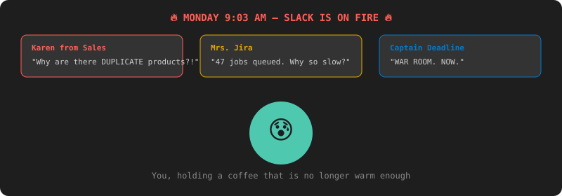
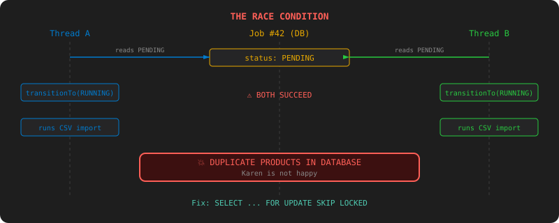
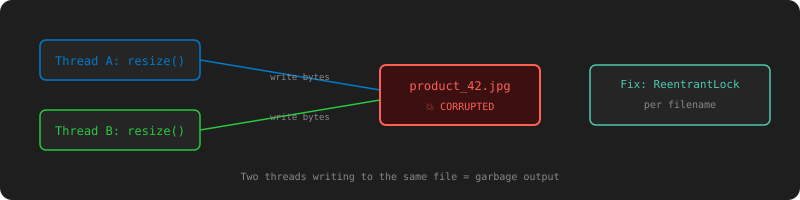
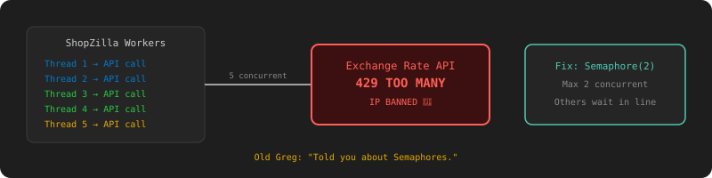
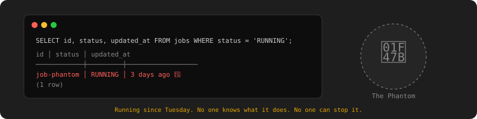
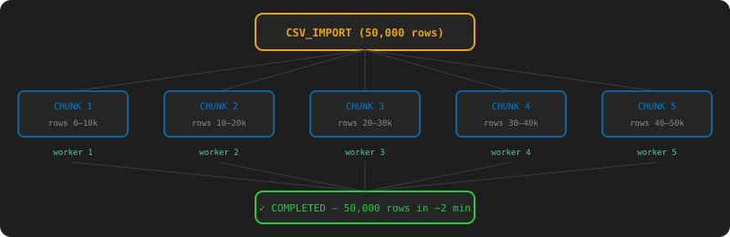

# Chapter 2: Karen Gets Duplicate Products — The Thundering Herd

[← Chapter 1: Your First Day](chapter-01-first-day.md) | [Chapter 3: Everything Breaks →](chapter-03-failure-handling.md)

---

## The Incident

Monday morning. 9:03 AM. You're sipping coffee when Slack explodes.

**Karen from Sales:** "Why are there duplicate products in the database? I imported one CSV and got everything twice."

**Mrs. Jira:** "Why is everything queued? I submitted 47 jobs and only one is running."

**Captain Deadline:** "WAR ROOM. NOW."

You check the logs. Karen submitted one CSV import. But the `products` table has every row duplicated. Meanwhile, 46 other jobs are sitting in PENDING because your engine processes one job at a time.

Two bugs. One Monday morning.



## Bug #1: One Job at a Time

Your engine polls every second and processes one job. Karen's 47 imports take 47 × 20 seconds = 15 minutes. The image team's 200 resizes queue behind them. Everyone is waiting.

The fix is obvious: run multiple jobs in parallel. Use threads.

### The Test That Proves It's Broken

```java
@Test
void tenJobs_shouldCompleteInParallel_notSequentially() {
    IntStream.range(0, 10).forEach(i ->
        jobRepository.save(new Job("CSV_IMPORT",
            "{\"file\": \"src/test/resources/batch_" + i + ".csv\"}")));

    // If sequential: ~10 seconds. If parallel with 5 threads: ~2 seconds.
    await().atMost(4, SECONDS).untilAsserted(() -> {
        long completed = jobRepository.countByStatus(JobStatus.COMPLETED);
        assertEquals(10, completed);
    });
}
```

This test fails. Your single-threaded engine takes 10+ seconds. Time to add threads.

### The Fix: Thread Pool

You create a `JobRunnerPool` — a managed pool of worker threads.

```java
// src/main/java/com/shopzilla/engine/JobRunnerPool.java
package com.shopzilla.engine;

import jakarta.annotation.PreDestroy;
import org.springframework.beans.factory.annotation.Value;
import org.springframework.stereotype.Component;

import java.util.concurrent.ExecutorService;
import java.util.concurrent.Executors;
import java.util.concurrent.TimeUnit;

@Component
public class JobRunnerPool {

    private final ExecutorService pool;

    public JobRunnerPool(@Value("${jobengine.pool-size:5}") int poolSize) {
        this.pool = Executors.newFixedThreadPool(poolSize);
    }

    public void submit(Runnable task) {
        pool.submit(task);
    }

    @PreDestroy
    public void shutdown() throws InterruptedException {
        pool.shutdown();
        pool.awaitTermination(30, TimeUnit.SECONDS);
    }
}
```

And update the poller to submit jobs to the pool instead of running them inline:

```java
@Scheduled(fixedDelay = 500)
public void poll() {
    jobRepository.findFirstByStatusOrderByCreatedAtAsc(JobStatus.PENDING)
        .ifPresent(job -> jobRunnerPool.submit(() -> process(job)));
}
```

Why not just `new Thread()`? Same reason you don't hire interns off the street with no HR. Thread pools manage lifecycle, reuse threads, and prevent your JVM from spawning 10,000 threads and dying.

The 10-job test passes in ~2 seconds. Mrs. Jira stops pinging you. For now.

## Bug #2: Karen Gets Duplicate Products

The threading fix introduced a worse bug. Here's what happened:

1. Thread A reads job #42 as PENDING
2. Thread B reads job #42 as PENDING (before A updates it)
3. Both call `transitionTo(PENDING, RUNNING)` — both succeed because the check-then-act is not atomic
4. Both run the CSV import
5. Karen gets every product twice



Remember the `⚠️ BUG` comment from Chapter 1? This is where it bites you.

### The Test That Proves It

```java
@Test
void twentyJobs_withFiveThreads_shouldNeverRunDuplicates() {
    // Track how many times each job executes
    ConcurrentHashMap<String, AtomicInteger> execCount = new ConcurrentHashMap<>();

    IntStream.range(0, 20).forEach(i -> {
        Job job = jobRepository.save(new Job("CSV_IMPORT",
            "{\"file\": \"src/test/resources/small.csv\"}"));
        execCount.put(job.getId(), new AtomicInteger(0));
    });

    // Wait for all to complete
    await().atMost(15, SECONDS).untilAsserted(() ->
        assertEquals(20, jobRepository.countByStatus(JobStatus.COMPLETED)));

    // Each job should have run exactly once
    execCount.forEach((id, count) ->
        assertEquals(1, count.get(), "Job " + id + " ran " + count.get() + " times"));
}
```

This test fails. Some jobs run twice.

### The Fix: Database-Level Locking

The `transitionTo()` method on the Java object is useless for thread safety — by the time you check the status, another thread already changed it. You need the database to be the arbiter.

```java
// src/main/java/com/shopzilla/repository/JobRepository.java
public interface JobRepository extends JpaRepository<Job, String> {

    @Query(value = """
        SELECT * FROM jobs
        WHERE status = 'PENDING'
        ORDER BY created_at ASC
        LIMIT 1
        FOR UPDATE SKIP LOCKED
        """, nativeQuery = true)
    Optional<Job> claimNextPendingJob();
}
```

`FOR UPDATE` locks the row. `SKIP LOCKED` means if another thread already locked it, skip it instead of waiting. This is the database doing what your Java code couldn't: making the check-and-claim atomic.

```java
@Transactional
public void claimAndProcess() {
    jobRepository.claimNextPendingJob().ifPresent(job -> {
        job.transitionTo(JobStatus.PENDING, JobStatus.RUNNING);
        jobRepository.save(job);
        // process outside the transaction...
    });
}
```

The duplicate test goes green. Karen stops getting double products.

Old Greg walks by. "You could have used `AtomicReference` on the status field." You stare at him. He's right — but the database lock is better because it works across multiple JVM instances too. You'll need that in Chapter 8.

## The Counter: "How Many Are We Doing?"

Captain Deadline walks by your desk. "How many jobs are running right now?"

You: "Uh..."

### The Test

```java
@Test
void activeCounter_shouldTrackRunningJobs() {
    IntStream.range(0, 3).forEach(i ->
        jobRepository.save(new Job("CSV_IMPORT",
            "{\"file\": \"src/test/resources/slow.csv\"}")));

    await().atMost(3, SECONDS).untilAsserted(() ->
        assertTrue(jobRunnerPool.getActiveCount() > 0));

    await().atMost(15, SECONDS).untilAsserted(() ->
        assertEquals(0, jobRunnerPool.getActiveCount()));
}
```

### The Fix: `AtomicInteger`

You can't use a regular `int`. Two threads doing `count++` at the same time can both read 3, both write 4. You lost a count. `AtomicInteger` uses CPU-level compare-and-swap (CAS) — no locks needed.

```java
private final AtomicInteger activeCount = new AtomicInteger(0);

private void process(Job job) {
    activeCount.incrementAndGet();
    try {
        // ... run the handler
    } finally {
        activeCount.decrementAndGet(); // always, even on crash
    }
}

public int getActiveCount() {
    return activeCount.get();
}
```

You add a stats endpoint:

```bash
curl http://localhost:8080/stats
# → {"active": 3, "poolSize": 5, "pending": 12, "completed": 1423}
```

Captain Deadline nods. He'll ask for Grafana later (Chapter 8).

## The Future: "Is It Done Yet?"

Mrs. Jira: "I submitted a job 5 minutes ago. Is it done?" You: "Let me check the database." Mrs. Jira: "That's barbaric."

### The Test

```java
@Test
void future_shouldResolveWhenJobCompletes() throws Exception {
    Job job = jobRepository.save(new Job("CSV_IMPORT",
        "{\"file\": \"src/test/resources/small.csv\"}"));

    CompletableFuture<Job> future = jobRunnerPool.submitWithFuture(job);

    Job result = future.get(5, SECONDS);
    assertEquals(JobStatus.COMPLETED, result.getStatus());
    assertNotNull(result.getResult());
}
```

### The Fix: `CompletableFuture`

A `Future` is a promise. "I don't have your answer yet, but I will. Here's a receipt."

```java
public CompletableFuture<Job> submitWithFuture(Job job) {
    CompletableFuture<Job> future = new CompletableFuture<>();
    pool.submit(() -> {
        try {
            process(job);
            future.complete(job);
        } catch (Exception e) {
            future.completeExceptionally(e);
        }
    });
    return future;
}
```

- `future.get(timeout, SECONDS)` — block until result or timeout
- `future.thenAccept(j -> ...)` — callback when done, no blocking

You add a long-poll endpoint:

```bash
# Blocks until the job completes (or 30s timeout)
curl http://localhost:8080/jobs/abc-123/wait?timeout=30
# → {"id":"abc-123","status":"COMPLETED","result":"500 rows imported"}
```

Mrs. Jira is satisfied. For now.

## The Lock: "One Printer, Five Interns"

The image team uploads 200 product photos. Your engine resizes them in parallel. Then you notice: some output images are corrupted. Two threads resized the same image simultaneously and wrote to the same file at the same time.



### The Test

```java
@Test
void twoThreads_resizingSameImage_shouldNotCorrupt() throws Exception {
    String image = "product_42.jpg";
    copyTestImage(image);

    ExecutorService pool = Executors.newFixedThreadPool(2);
    Future<?> f1 = pool.submit(() -> imageResizeHandler.resize(image));
    Future<?> f2 = pool.submit(() -> imageResizeHandler.resize(image));
    f1.get(); f2.get();

    assertTrue(isValidImage("output/" + image));
}
```

### The Fix: `ReentrantLock`

```java
private final ConcurrentHashMap<String, ReentrantLock> locks = new ConcurrentHashMap<>();

public void resize(String filename) {
    ReentrantLock lock = locks.computeIfAbsent(filename, k -> new ReentrantLock());
    try {
        if (!lock.tryLock(5, TimeUnit.SECONDS)) {
            return; // another thread is handling this image
        }
        try {
            // ... resize the image
        } finally {
            lock.unlock();
        }
    } catch (InterruptedException e) {
        Thread.currentThread().interrupt();
    }
}
```

`tryLock(5, SECONDS)` — try to acquire, give up after 5s instead of waiting forever. Always unlock in `finally` — a locked lock with a dead thread is called a **deadlock**.

Old Greg: "When do you use `synchronized` vs `ReentrantLock`?"

| Tool | Use When |
|---|---|
| `synchronized` | Simple, one resource, no timeout needed |
| `ReentrantLock` | Need `tryLock`, timeout, or multiple conditions |
| `AtomicInteger` | Just a counter or flag |
| `ConcurrentHashMap` | Shared map, many readers, some writers |

No more corrupted images.

## The Bounded Queue: "The Waiting Room"

Karen submits 500 jobs. Your poller keeps pulling from the DB and submitting to the thread pool. The pool's internal queue grows without bound. Memory goes through the roof. Silent Bob sends a 🔥 emoji.

### The Test

```java
@Test
void boundedQueue_shouldApplyBackpressure() {
    IntStream.range(0, 500).forEach(i ->
        jobRepository.save(new Job("IMAGE_RESIZE",
            "{\"dir\": \"big_" + i + "\"}")));

    // Give the poller a few cycles
    await().during(3, SECONDS).then().untilAsserted(() -> {
        assertTrue(jobRunnerPool.getQueueSize() <= 20);
        assertTrue(jobRepository.countByStatus(JobStatus.PENDING) > 100);
    });
}
```

### The Fix: Bounded `BlockingQueue`

```java
public JobRunnerPool(int poolSize) {
    BlockingQueue<Runnable> queue = new LinkedBlockingQueue<>(20);
    this.pool = new ThreadPoolExecutor(
        poolSize, poolSize, 0L, TimeUnit.MILLISECONDS, queue,
        new ThreadPoolExecutor.CallerRunsPolicy()
    );
}
```

When the queue is full, the poller **stops polling** — this is backpressure. Jobs stay safely in Postgres until there's room.

Like a restaurant with 20 seats. When it's full, new customers wait outside (in the DB), not crammed into the kitchen.

```bash
curl http://localhost:8080/stats
# → {"active": 5, "queued": 20, "pending": 475, "poolSize": 5}
```

Silent Bob sends a 👍.


## The Priority Queue: "VIP Line"

Karen's CRITICAL import is stuck behind an intern's LOW job. Karen walks to your desk. She is not smiling.

"WHY IS MY JOB BEHIND AN INTERN'S?"

Mrs. Jira adds a priority field to the ticket. You add one to the engine.

### The Test

```java
@Test
void criticalJob_shouldRunBeforeLowJobs() {
    IntStream.range(0, 5).forEach(i ->
        jobRepository.save(new Job("CSV_IMPORT",
            "{\"file\": \"low_" + i + ".csv\"}", Priority.LOW)));

    Job critical = jobRepository.save(new Job("CSV_IMPORT",
        "{\"file\": \"urgent.csv\"}", Priority.CRITICAL));

    await().atMost(5, SECONDS).untilAsserted(() -> {
        Job updated = jobRepository.findById(critical.getId()).orElseThrow();
        assertEquals(JobStatus.COMPLETED, updated.getStatus());
    });
}
```

### The Fix: `PriorityBlockingQueue`

Add a `priority` field to `Job`: `CRITICAL(0)`, `HIGH(1)`, `NORMAL(2)`, `LOW(3)`. Lower number = higher priority.

```java
public class PriorityJobTask implements Runnable, Comparable<PriorityJobTask> {
    private final int priority;
    private final Instant createdAt;
    private final Runnable task;

    @Override
    public int compareTo(PriorityJobTask other) {
        int cmp = Integer.compare(this.priority, other.priority);
        return cmp != 0 ? cmp : this.createdAt.compareTo(other.createdAt);
    }

    @Override
    public void run() { task.run(); }
}
```

Update the DB claim query too: `ORDER BY priority ASC, created_at ASC`.

| Queue | Behavior |
|---|---|
| `LinkedBlockingQueue` | FIFO, bounded, simple |
| `PriorityBlockingQueue` | Sorted by priority, unbounded (cap manually) |
| `DelayQueue` | Items available after a delay (useful for retries) |
| `SynchronousQueue` | Direct hand-off, no buffer |

Karen's CRITICAL job jumps the line. She stops glaring at you.

## The Countdown: "Wait for the Batch"

Karen: "I submitted 10 CSV imports. Tell me when ALL of them are done. Not one. All."

### The Test

```java
@Test
void batchWait_shouldReturnWhenAllComplete() {
    List<Job> jobs = IntStream.range(0, 3)
        .mapToObj(i -> jobRepository.save(new Job("CSV_IMPORT",
            "{\"file\": \"batch_" + i + ".csv\"}")))
        .toList();

    CountDownLatch latch = new CountDownLatch(3);
    jobs.forEach(j -> jobRunnerPool.submitWithCallback(j, result -> latch.countDown()));

    assertTrue(latch.await(10, SECONDS));
}
```

### The Fix: `CountDownLatch`

A one-shot gate that opens when N things complete.

```java
CountDownLatch latch = new CountDownLatch(n);
// each job's callback:
latch.countDown();
// the waiter:
latch.await(timeout, SECONDS); // blocks until all N finish
```

```bash
curl -X POST http://localhost:8080/jobs/batch \
  -H "Content-Type: application/json" \
  -d '[{"type":"CSV_IMPORT","payload":"{}"},{"type":"CSV_IMPORT","payload":"{}"}]'
# → {"batchId": "batch-001", "jobCount": 2}

curl http://localhost:8080/jobs/batch/batch-001/wait?timeout=30
# blocks... then returns when all complete
# → {"completed": 2, "failed": 0}
```

## The Semaphore: "Only 2 at a Time"

The exchange-rate API for `PRICE_CALCULATION` has a rate limit: max 2 concurrent requests. You send 5. They ban your IP. Old Greg: "Told you about Semaphores."



### The Test

```java
@Test
void semaphore_shouldLimitConcurrentApiCalls() {
    AtomicInteger maxConcurrent = new AtomicInteger(0);
    AtomicInteger concurrent = new AtomicInteger(0);

    apiClient.setOnCall(() -> {
        int c = concurrent.incrementAndGet();
        maxConcurrent.updateAndGet(m -> Math.max(m, c));
        Thread.sleep(500);
        concurrent.decrementAndGet();
    });

    IntStream.range(0, 5).forEach(i ->
        jobRepository.save(new Job("PRICE_CALCULATION",
            "{\"productId\": " + i + "}")));

    await().atMost(10, SECONDS).untilAsserted(() ->
        assertEquals(5, jobRepository.countByStatus(JobStatus.COMPLETED)));

    assertTrue(maxConcurrent.get() <= 2);
}
```

### The Fix: `Semaphore`

```java
private final Semaphore apiSemaphore = new Semaphore(2);

public String execute(Job job) throws Exception {
    apiSemaphore.acquire();
    try {
        return callExchangeRateApi(job);
    } finally {
        apiSemaphore.release();
    }
}
```

Unlike a lock (1 key, 1 door), a semaphore is N keys, 1 door. Perfect for rate limiting.

## Virtual Threads: "Infinite Interns, Zero Cost"

Captain Deadline: "Can we handle 1,000 concurrent jobs?" Old Greg: "You'd need 1,000 threads. That's 1GB of stack memory." You: "What about virtual threads?"

### The Test

```java
@Test
void virtualThreads_shouldHandle1000ConcurrentIoJobs() {
    IntStream.range(0, 1000).forEach(i ->
        jobRepository.save(new Job("CSV_IMPORT",
            "{\"file\": \"src/test/resources/tiny.csv\"}")));

    await().atMost(30, SECONDS).untilAsserted(() ->
        assertEquals(1000, jobRepository.countByStatus(JobStatus.COMPLETED)));
}
```

### The Fix: Project Loom (Java 21)

```java
// For I/O-bound jobs: virtual threads (~1KB each, not ~1MB)
private final ExecutorService virtualPool =
    Executors.newVirtualThreadPerTaskExecutor();

// For CPU-bound jobs: platform threads (IMAGE_RESIZE)
private final ExecutorService cpuPool =
    Executors.newFixedThreadPool(Runtime.getRuntime().availableProcessors());
```

Virtual threads are cheap. They yield during blocking I/O (file reads, HTTP calls, DB queries) and let other virtual threads run on the same carrier thread. Perfect for CSV imports and API calls. Keep platform threads for CPU-bound work like image resizing.

1,000 I/O jobs complete in under 30 seconds. Captain Deadline raises an eyebrow. That's the closest he gets to a smile.

## Graceful Shutdown: "Closing Time"

You deploy a new version. `kill -9`. Three jobs die mid-execution. Their status is stuck on RUNNING forever. The Phantom is born.



### The Tests

```java
@Test
void gracefulShutdown_shouldFinishInFlightJobs() {
    IntStream.range(0, 3).forEach(i ->
        jobRepository.save(new Job("IMAGE_RESIZE",
            "{\"dir\": \"slow_" + i + "\"}")));

    await().atMost(3, SECONDS).untilAsserted(() ->
        assertEquals(3, jobRepository.countByStatus(JobStatus.RUNNING)));

    jobRunnerPool.shutdown();

    await().atMost(15, SECONDS).untilAsserted(() -> {
        assertEquals(3, jobRepository.countByStatus(JobStatus.COMPLETED));
        assertEquals(0, jobRepository.countByStatus(JobStatus.RUNNING));
    });
}

@Test
void onStartup_shouldRecoverStuckJobs() {
    // Simulate a crashed job: RUNNING, updated 10 min ago
    Job stuck = new Job("CSV_IMPORT", "{}");
    stuck.transitionTo(JobStatus.PENDING, JobStatus.RUNNING);
    // ... set updatedAt to 10 minutes ago
    jobRepository.save(stuck);

    stuckJobRecovery.recover();

    Job recovered = jobRepository.findById(stuck.getId()).orElseThrow();
    assertEquals(JobStatus.PENDING, recovered.getStatus());
}
```

### The Fix

```java
@PreDestroy
public void shutdown() throws InterruptedException {
    pool.shutdown();                              // stop accepting new jobs
    if (!pool.awaitTermination(30, SECONDS)) {    // wait for in-flight
        pool.shutdownNow();                       // force-kill if stuck
    }
}
```

On startup, find RUNNING jobs older than 5 minutes and reset them to PENDING:

```java
@Component
public class StuckJobRecovery {
    @EventListener(ApplicationReadyEvent.class)
    public void recover() {
        int reset = jobRepository.resetStuckJobs(Instant.now().minus(5, MINUTES));
        if (reset > 0) log.warn("Recovered {} stuck jobs", reset);
    }
}
```

The Phantom is exorcised.

## The Assembly Line: "Split the Work"

Karen's CSV has 50,000 rows. One worker takes 10 minutes. Karen: "I have 5 workers sitting idle. Why can't they all work on it together?"

She's right.



### The Test

```java
@Test
void forkJoin_shouldSplitCsvAcrossWorkers() {
    Job parent = jobRepository.save(new Job("CSV_IMPORT",
        "{\"file\": \"huge.csv\", \"rows\": 50000, \"chunkSize\": 10000}"));

    await().atMost(30, SECONDS).untilAsserted(() -> {
        Job updated = jobRepository.findById(parent.getId()).orElseThrow();
        assertEquals(JobStatus.COMPLETED, updated.getStatus());
    });

    List<Job> chunks = jobRepository.findByParentJobId(parent.getId());
    assertEquals(5, chunks.size());
    chunks.forEach(c -> assertEquals(JobStatus.COMPLETED, c.getStatus()));
}
```

### The Fix

Add `parentJobId` and `chunkIndex` to the `Job` entity. The parent job creates N child chunks, each claimed by a different worker:

```
     PARENT (50,000 rows) → status: SPLITTING
     ┌──────┬──────┬──────┬──────┐
     ▼      ▼      ▼      ▼      ▼
   CHUNK1 CHUNK2 CHUNK3 CHUNK4 CHUNK5
   0-10k  10-20k 20-30k 30-40k 40-50k
   (wkr1) (wkr2) (wkr3) (wkr4) (wkr5)
     └──────┴──────┴──────┴──────┘
                   ▼
             PARENT → COMPLETED
```

Use `CompletableFuture.allOf(chunks)` to wait for all chunks. If chunk 3 fails, retry just chunk 3 — not the whole job.

Total time: ~2 minutes instead of 10. Karen is almost happy. (Almost.)

## The Hot Path: "1,000 Requests Per Second"

Captain Deadline shows you the traffic graph. "Black Friday is in 3 weeks. We'll get 1,000 job submissions per second. Will it hold?"

You check your code. The poller hits Postgres every second. Every `GET /jobs/{id}` queries the database. Every stats call is a `SELECT COUNT(*)`. Silent Bob sends 🐌.

### The Tests

```java
@Test
void redis_shouldServeStatsWithoutHittingDb() {
    IntStream.range(0, 100).forEach(i ->
        jobRepository.save(new Job("CSV_IMPORT", "{}")));

    StatsResponse stats = restTemplate.getForObject("/stats", StatsResponse.class);
    assertTrue(stats.getPending() > 0);
    assertEquals(0, queryCounter.getCountFor("SELECT COUNT"));
}

@Test
void idempotencyKey_shouldPreventDuplicateSubmission() {
    String key = UUID.randomUUID().toString();
    Job first = submitWithKey("CSV_IMPORT", "{}", key);
    Job second = submitWithKey("CSV_IMPORT", "{}", key);

    assertEquals(first.getId(), second.getId());
}
```

### The Fix: Redis

Four problems, four Redis fixes:

| Problem | Fix |
|---|---|
| Poller hammers Postgres | Redis `LIST` — `RPUSH`/`BLPOP` as job queue |
| API clients flood DB | Redis cache — `@Cacheable`/`@CacheEvict` |
| Stats = full table scan | Redis `INCR`/`DECR` counters per status |
| Karen double-clicks submit | `SET NX EX` idempotency key |

```
  Client                Redis                    Postgres
    │                     │                         │
    ├─ POST /jobs ───────►├─ RPUSH job:queue ──────►├─ INSERT job
    ├─ GET /jobs/{id} ──►├─ GET cache (hit!)       │
    ├─ GET /stats ───────►├─ GET counters           │  (no DB!)
```

Stats respond in <10ms. Duplicate submissions return the same job. Postgres query count drops by 90%.

## Chapter 2 Concept Map


```
                              Redis
                    ┌─────────────────────┐
                    │ LIST   → job queue   │
                    │ STRING → cache       │
                    │ INCR   → stats       │
                    │ SET NX → idempotency │
                    └────────┬────────────┘
                             │
                    ┌────────▼────────┐
                    │  ExecutorService │
                    └────────┬────────┘
                             │
                    ┌────────▼────────┐
                    │ PriorityBlocking│
                    │ Queue           │
                    └────────┬────────┘
                             │
              ┌──────────────┼──────────────┐
              ▼              ▼              ▼
         Thread 1       Thread 2       Thread 3
              │              │              │
         AtomicInt      Semaphore     ReentrantLock
         (counter)      (API cap)     (file lock)
              │              │              │
              └──────────────┼──────────────┘
                             │
                    CompletableFuture → CountDownLatch → Fork/Join
```

## What You Learned

You started this chapter with a single-threaded engine that processed one job at a time. You ended with:

- **`ExecutorService`** — managed thread pool
- **`SELECT FOR UPDATE SKIP LOCKED`** — database-level race condition prevention
- **`AtomicInteger`** — lock-free counters
- **`CompletableFuture`** — async results
- **`ReentrantLock`** — file-level mutual exclusion
- **`LinkedBlockingQueue`** — bounded queue with backpressure
- **`PriorityBlockingQueue`** — VIP line for urgent jobs
- **`CountDownLatch`** — waiting for N things to finish
- **`Semaphore`** — rate limiting external APIs
- **Virtual Threads** — 1,000 concurrent I/O jobs for ~1MB
- **Graceful shutdown** — no more Phantoms
- **Fork/Join** — splitting big jobs across workers
- **Redis** — caching, queuing, stats, idempotency

Every one of these was introduced because something broke. The bugs came first. The theory followed.

Next chapter: the exchange-rate API goes down, and you learn that failure isn't a bug — it's a feature you forgot to handle.

---

[← Chapter 1: Your First Day](chapter-01-first-day.md) | [Chapter 3: Everything Breaks →](chapter-03-failure-handling.md)
