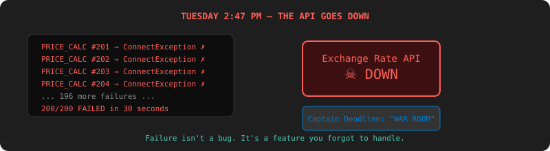
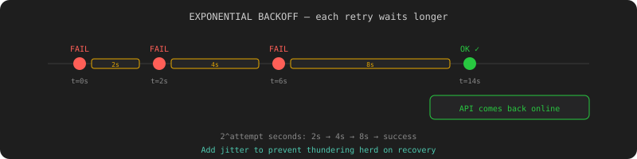

# Chapter 3: Everything Breaks — Failure Handling & Retries

[← Chapter 2: Karen Gets Duplicate Products](chapter-02-multithreading.md) | [Chapter 4: The Big Red Button →](chapter-04-pause-resume-cancel.md)

---

## The Incident

Tuesday. 2:47 PM. The exchange-rate API goes down.

Every `PRICE_CALCULATION` job throws a `ConnectException`. Your engine catches the exception, marks the job FAILED, and moves on. All 200 price calculations fail in 30 seconds. Karen's product prices are wrong. Mrs. Jira's Slack lights up like a Christmas tree.

**Captain Deadline:** "WAR ROOM."

**You:** "The API is down. It's not our fault."

**Captain Deadline:** "It's our fault that we didn't handle it."

He's right. In distributed systems, failure isn't a bug — it's a feature you forgot to handle.



But there's a worse bug hiding. You check the logs and notice something: when a `PRICE_CALCULATION` job throws an exception, the worker thread... also dies. The next job in the queue never gets picked up. One bad job poisons the entire worker.

## Bug #1: One Bad Job Kills the Worker

### The Test

```java
@Test
void failingJob_shouldNotKillWorkerThread() {
    Job bad = jobRepository.save(new Job("PRICE_CALCULATION",
        "{\"apiUrl\": \"http://down.example.com\"}"));
    Job good = jobRepository.save(new Job("CSV_IMPORT",
        "{\"file\": \"src/test/resources/small.csv\"}"));

    await().atMost(10, SECONDS).untilAsserted(() -> {
        assertEquals(JobStatus.FAILED,
            jobRepository.findById(bad.getId()).orElseThrow().getStatus());
        assertEquals(JobStatus.COMPLETED,
            jobRepository.findById(good.getId()).orElseThrow().getStatus());
    });
}
```

This test fails. The good job never completes because the worker thread died on the bad job.

### The Fix

Wrap every handler call in try/catch. The worker thread must survive.

```java
private void process(Job job) {
    activeCount.incrementAndGet();
    try {
        job.transitionTo(JobStatus.PENDING, JobStatus.RUNNING);
        jobRepository.save(job);

        String result = dispatch(job);
        job.setResult(result);
        job.transitionTo(JobStatus.RUNNING, JobStatus.COMPLETED);
    } catch (Exception e) {
        job.setErrorMessage(e.getClass().getSimpleName() + ": " + e.getMessage());
        job.transitionTo(JobStatus.RUNNING, JobStatus.FAILED);
    } finally {
        jobRepository.save(job);
        activeCount.decrementAndGet();
    }
}
```

The bad job fails. The good job completes. The worker lives on.

## Bug #2: No Retries

The API was down for 3 minutes. All 200 jobs failed permanently. But if you'd just waited and tried again, they would have succeeded. "Just try again" — every non-engineer ever. But how many times? How fast?

### The Test

```java
@Test
void retryPolicy_shouldRetryWithExponentialBackoff() {
    apiMock.failNextNCalls(3); // fail 3 times, then succeed

    Job job = jobRepository.save(new Job("PRICE_CALCULATION",
        "{\"productId\": 1}", RetryPolicy.exponential(5, Duration.ofSeconds(1))));

    await().atMost(30, SECONDS).untilAsserted(() -> {
        Job updated = jobRepository.findById(job.getId()).orElseThrow();
        assertEquals(JobStatus.COMPLETED, updated.getStatus());
        assertEquals(3, updated.getRetryCount());
    });
}
```

### The Fix

Add retry fields to the `Job` entity:

```java
private int retryCount = 0;
private int maxRetries = 0;
private Instant nextRetryAt;

@Enumerated(EnumType.STRING)
private BackoffStrategy backoffStrategy = BackoffStrategy.EXPONENTIAL;
```

New status: `RETRYING`. The poller picks it up again after `nextRetryAt`:

```java
@Query(value = """
    SELECT * FROM jobs
    WHERE (status = 'PENDING' OR (status = 'RETRYING' AND next_retry_at <= NOW()))
    ORDER BY priority ASC, created_at ASC
    LIMIT 1
    FOR UPDATE SKIP LOCKED
    """, nativeQuery = true)
Optional<Job> claimNextJob();
```

The backoff calculator:

```java
public class BackoffCalculator {
    public static Duration calculate(BackoffStrategy strategy, int attempt) {
        return switch (strategy) {
            case FIXED -> Duration.ofSeconds(5);
            case EXPONENTIAL -> Duration.ofSeconds((long) Math.pow(2, attempt));
            case EXPONENTIAL_WITH_JITTER -> {
                long base = (long) Math.pow(2, attempt);
                long jitter = ThreadLocalRandom.current().nextLong(base);
                yield Duration.ofSeconds(base + jitter);
            }
        };
    }
}
```

In the catch block:

```java
} catch (Exception e) {
    job.setErrorMessage(e.getMessage());
    if (job.getRetryCount() < job.getMaxRetries()) {
        job.setRetryCount(job.getRetryCount() + 1);
        Duration delay = BackoffCalculator.calculate(
            job.getBackoffStrategy(), job.getRetryCount());
        job.setNextRetryAt(Instant.now().plus(delay));
        job.transitionTo(JobStatus.RUNNING, JobStatus.RETRYING);
    } else {
        job.transitionTo(JobStatus.RUNNING, JobStatus.FAILED);
    }
}
```

Retry 1: wait 2s. Retry 2: wait 4s. Retry 3: wait 8s. The API comes back after 3 minutes. The job succeeds on retry 4.



## The Dead Letter Box

Old Greg: "If it failed 5 times, it's not going to work a 6th time. Stop torturing it."

### The Test

```java
@Test
void exhaustedRetries_shouldLandInDeadLetter() {
    apiMock.failAlways();

    Job job = jobRepository.save(new Job("PRICE_CALCULATION",
        "{\"productId\": 1}", RetryPolicy.fixed(3, Duration.ofSeconds(1))));

    await().atMost(20, SECONDS).untilAsserted(() -> {
        Job updated = jobRepository.findById(job.getId()).orElseThrow();
        assertEquals(JobStatus.DEAD, updated.getStatus());
        assertEquals(3, updated.getRetryCount());
        assertNotNull(updated.getErrorMessage());
    });
}
```

### The Fix

After `maxRetries` exhausted → status `DEAD`. The graveyard.

```bash
# List dead jobs
curl http://localhost:8080/jobs?status=DEAD
# → [{"id":"abc-123","type":"PRICE_CALCULATION","retryCount":3,
#     "errorMessage":"ConnectException: Connection refused"}]

# Manually retry after fixing the root cause
curl -X POST http://localhost:8080/jobs/abc-123/resurrect
# → {"id":"abc-123","status":"PENDING","retryCount":0}
```

Dead jobs don't disappear. They sit in the graveyard until someone reviews them and either fixes the root cause or acknowledges the failure. Captain Deadline likes this. "Accountability," he says.

## The Heartbeat: Detecting The Phantom

Remember The Phantom from Chapter 2? You fixed the shutdown bug, but there's another way a job gets stuck: a thread hangs on a socket timeout. The job is "RUNNING" but the thread is blocked on `read()`. It's been 45 minutes. No exception. No timeout. Just... waiting.

### The Test

```java
@Test
void stalledJob_shouldBeDetectedAndReset() {
    Job stuck = new Job("PRICE_CALCULATION", "{}");
    stuck.transitionTo(JobStatus.PENDING, JobStatus.RUNNING);
    stuck.setLastHeartbeatAt(Instant.now().minus(10, ChronoUnit.MINUTES));
    jobRepository.save(stuck);

    stalledJobDetector.detect();

    Job recovered = jobRepository.findById(stuck.getId()).orElseThrow();
    assertEquals(JobStatus.PENDING, recovered.getStatus());
}
```

### The Fix

Jobs send a heartbeat every 30 seconds during execution:

```java
private void process(Job job) {
    ScheduledFuture<?> heartbeat = scheduler.scheduleAtFixedRate(
        () -> {
            job.setLastHeartbeatAt(Instant.now());
            jobRepository.save(job);
        },
        0, 30, TimeUnit.SECONDS
    );

    try {
        // ... run the handler
    } finally {
        heartbeat.cancel(false);
    }
}
```

A `StalledJobDetector` runs every minute and finds RUNNING jobs with no heartbeat for 5 minutes:

```java
@Scheduled(fixedRate = 60_000)
public void detect() {
    Instant cutoff = Instant.now().minus(5, ChronoUnit.MINUTES);
    int reset = jobRepository.resetStalledJobs(cutoff);
    if (reset > 0) log.warn("Reset {} stalled jobs", reset);
}
```

No more Phantoms. If a job goes silent, the engine notices and requeues it.

## Partial Failure: "197 Out of 200"

`INVENTORY_SYNC` processes 200 items against the warehouse API. 197 succeed. 3 fail because the warehouse returned garbage for those SKUs. Do you fail the whole job?

### The Test

```java
@Test
void partialFailure_shouldReportBothCounts() {
    Job job = jobRepository.save(new Job("INVENTORY_SYNC",
        "{\"items\": 200, \"failItems\": [5, 42, 199]}"));

    await().atMost(15, SECONDS).untilAsserted(() -> {
        Job updated = jobRepository.findById(job.getId()).orElseThrow();
        assertEquals(JobStatus.COMPLETED_WITH_ERRORS, updated.getStatus());
        assertTrue(updated.getResult().contains("\"success\":197"));
        assertTrue(updated.getResult().contains("\"failed\":3"));
    });
}
```

### The Fix

New status: `COMPLETED_WITH_ERRORS`. The result contains both counts:

```java
public class InventorySyncHandler {
    public String execute(Job job) {
        List<String> failedItems = new ArrayList<>();
        int success = 0;

        for (InventoryItem item : parseItems(job.getPayload())) {
            try {
                syncItem(item);
                success++;
            } catch (Exception e) {
                failedItems.add(item.getSku() + ": " + e.getMessage());
            }
        }

        if (!failedItems.isEmpty()) {
            job.transitionTo(JobStatus.RUNNING, JobStatus.COMPLETED_WITH_ERRORS);
        }

        return String.format("{\"success\":%d,\"failed\":%d,\"failedItems\":%s}",
            success, failedItems.size(), failedItems);
    }
}
```

```bash
curl http://localhost:8080/jobs/inv-001
# → {"status":"COMPLETED_WITH_ERRORS",
#    "result":"{\"success\":197,\"failed\":3,\"failedItems\":[\"SKU-005: timeout\",...]}"}
```

197 items synced. 3 failed. The job didn't lie about either.

## What You Learned

You started this chapter with an engine that treated every failure as permanent and every exception as fatal. You ended with:

- **Exception isolation** — one bad job doesn't kill the worker thread
- **Retry with backoff** — FIXED, EXPONENTIAL, EXPONENTIAL_WITH_JITTER
- **Dead-letter queue** — stop retrying after N attempts, surface for review
- **Heartbeat monitoring** — detect stuck/zombie jobs automatically
- **Partial failure** — report success and failure counts per item
- **`RETRYING`**, **`DEAD`**, **`COMPLETED_WITH_ERRORS`** — three new statuses

The exchange-rate API goes down again on Thursday. This time, the jobs retry automatically, succeed after 2 minutes, and Karen never notices. You sip your coffee.

Next chapter: Karen imports the wrong file and needs you to stop it. Right now. While it's running.

---

[← Chapter 2: Karen Gets Duplicate Products](chapter-02-multithreading.md) | [Chapter 4: The Big Red Button →](chapter-04-pause-resume-cancel.md)
