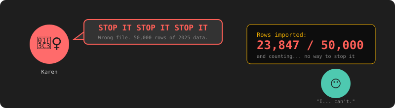
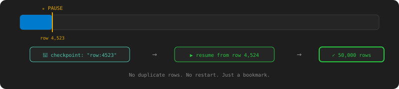

# Chapter 4: The Big Red Button — Pause, Resume & Cancel

[← Chapter 3: Everything Breaks](chapter-03-failure-handling.md) | [Chapter 5: The Dependency Web →](chapter-05-dag-execution.md)

---

## The Incident

Wednesday. 10:15 AM. Karen runs to your desk. She's out of breath.

"STOP IT. STOP IT STOP IT STOP IT."

She submitted a CSV import with the wrong file. 50,000 rows of last year's data are pouring into the products table. Prices are wrong. SKUs are duplicated. The sales team is quoting customers from 2025.

You look at your engine. There's no cancel button. There's no pause. Once a job starts, it runs to completion. You watch helplessly as row 23,000... 24,000... 25,000... stream into the database.

"I... can't stop it."

Karen stares at you. Old Greg stares at you. Captain Deadline stares at you from across the office. Silent Bob sends 🪦.



Time to build the big red button.

## Cancel: The Emergency Brake

### The Test

```java
@Test
void cancelRunningJob_shouldStopWithinTwoSeconds() {
    Job job = jobRepository.save(new Job("CSV_IMPORT",
        "{\"file\": \"src/test/resources/huge.csv\", \"rows\": 50000}"));

    // Wait for it to start
    await().atMost(3, SECONDS).untilAsserted(() ->
        assertEquals(JobStatus.RUNNING,
            jobRepository.findById(job.getId()).orElseThrow().getStatus()));

    // Hit the cancel endpoint
    restTemplate.postForEntity("/jobs/" + job.getId() + "/cancel", null, Void.class);

    // Should stop within 2 seconds
    await().atMost(2, SECONDS).untilAsserted(() ->
        assertEquals(JobStatus.CANCELLED,
            jobRepository.findById(job.getId()).orElseThrow().getStatus()));

    // Should have processed far fewer than 50,000 rows
    assertTrue(productRepository.count() < 50000);
}
```

### The Fix

You can't just kill a thread. `Thread.stop()` was deprecated in Java 1.2 because it leaves objects in inconsistent states. Instead, you use **cooperative cancellation** — the handler checks a flag between work units and exits gracefully.

First, the `JobContext` — a shared object between the engine and the handler:

```java
public class JobContext {
    private volatile boolean cancelled = false;
    private volatile boolean paused = false;
    private String checkpoint;

    public boolean isCancelled() { return cancelled; }
    public void requestCancel() { this.cancelled = true; }
    public boolean isPaused() { return paused; }
    public void requestPause() { this.paused = true; }
    public void setCheckpoint(String cp) { this.checkpoint = cp; }
    public String getCheckpoint() { return checkpoint; }
}
```

The `volatile` keyword ensures that when the API thread sets `cancelled = true`, the worker thread sees it immediately — no CPU cache staleness.

The handler checks the flag in its inner loop:

```java
public class CsvImportHandler {
    public String execute(Job job, JobContext ctx) throws Exception {
        String file = extractFile(job.getPayload());
        int count = 0;

        try (BufferedReader reader = new BufferedReader(new FileReader(file))) {
            reader.readLine(); // skip header
            String line;
            while ((line = reader.readLine()) != null) {
                if (ctx.isCancelled()) {
                    return count + " rows imported (cancelled)";
                }
                insertRow(line);
                count++;
            }
        }
        return count + " rows imported";
    }
}
```

The cancel endpoint sets the flag:

```java
@PostMapping("/{id}/cancel")
public Job cancel(@PathVariable String id) {
    Job job = jobRepository.findById(id).orElseThrow();
    JobContext ctx = activeContexts.get(id);
    if (ctx != null) ctx.requestCancel();
    job.transitionTo(JobStatus.RUNNING, JobStatus.CANCELLING);
    jobRepository.save(job);
    return job;
}
```

The engine detects the cancellation after the handler returns:

```java
if (ctx.isCancelled()) {
    job.transitionTo(JobStatus.CANCELLING, JobStatus.CANCELLED);
}
```

```bash
# Submit a big job
curl -X POST http://localhost:8080/jobs \
  -d '{"type":"CSV_IMPORT","payload":"{\"file\":\"huge.csv\"}"}'
# → {"id":"job-001","status":"PENDING"}

# Cancel it
curl -X POST http://localhost:8080/jobs/job-001/cancel
# → {"id":"job-001","status":"CANCELLING"}

# Check — it stopped
curl http://localhost:8080/jobs/job-001
# → {"id":"job-001","status":"CANCELLED","result":"12,847 rows imported (cancelled)"}
```

Karen's bad import stops at row 12,847 instead of 50,000. You clean up the bad data. Crisis averted.

## Pause & Resume: The Bookmark

Karen: "Wait, don't cancel it. Just... pause it. I need to check something."

She wants to pause a running job, verify the data looks right, then resume it from where it left off — not restart from the beginning.

### The Test

```java
@Test
void pauseAndResume_shouldContinueFromCheckpoint() {
    Job job = jobRepository.save(new Job("CSV_IMPORT",
        "{\"file\": \"src/test/resources/huge.csv\", \"rows\": 50000}"));

    // Wait for some progress
    await().atMost(5, SECONDS).untilAsserted(() ->
        assertTrue(productRepository.count() > 1000));

    // Pause
    restTemplate.postForEntity("/jobs/" + job.getId() + "/pause", null, Void.class);
    await().atMost(2, SECONDS).untilAsserted(() ->
        assertEquals(JobStatus.PAUSED,
            jobRepository.findById(job.getId()).orElseThrow().getStatus()));

    long rowsBeforeResume = productRepository.count();

    // Resume
    restTemplate.postForEntity("/jobs/" + job.getId() + "/resume", null, Void.class);
    await().atMost(60, SECONDS).untilAsserted(() ->
        assertEquals(JobStatus.COMPLETED,
            jobRepository.findById(job.getId()).orElseThrow().getStatus()));

    // No duplicate rows
    assertEquals(50000, productRepository.count());
}
```

### The Fix: Checkpointing

When the handler detects a pause request, it saves its progress before stopping:

```java
while ((line = reader.readLine()) != null) {
    if (ctx.isCancelled()) {
        return count + " rows imported (cancelled)";
    }
    if (ctx.isPaused()) {
        ctx.setCheckpoint("row:" + count);
        return count + " rows imported (paused)";
    }
    insertRow(line);
    count++;
}
```

The checkpoint is saved to the job's payload. When resumed, the handler reads it and skips ahead:

```java
int startRow = parseCheckpoint(job.getPayload()); // 0 if no checkpoint
// skip `startRow` lines...
```

```bash
# Pause
curl -X POST http://localhost:8080/jobs/job-001/pause
# → {"status":"PAUSED","result":"4,523 rows imported (paused)"}

# Check the data, verify it looks right...

# Resume from where it left off
curl -X POST http://localhost:8080/jobs/job-001/resume
# → {"status":"PENDING"}  (poller picks it up, continues from row 4,524)
```



## Batch Operations

Mrs. Jira: "Cancel ALL the price calculations. The tax rules changed."

### The Test

```java
@Test
void batchCancel_shouldCancelAllOfType() {
    IntStream.range(0, 5).forEach(i ->
        jobRepository.save(new Job("PRICE_CALCULATION",
            "{\"productId\": " + i + "}")));

    restTemplate.postForEntity("/jobs/cancel?type=PRICE_CALCULATION", null, Void.class);

    await().atMost(5, SECONDS).untilAsserted(() ->
        assertEquals(5, jobRepository.countByTypeAndStatus(
            "PRICE_CALCULATION", JobStatus.CANCELLED)));
}
```

```bash
curl -X POST "http://localhost:8080/jobs/cancel?type=PRICE_CALCULATION"
# → {"cancelled": 5}
```

Same cooperative mechanism, applied in bulk. Every running PRICE_CALCULATION handler checks `ctx.isCancelled()` on its next iteration and exits.

## What You Learned

- **Cooperative cancellation** — why `Thread.stop()` is evil and `volatile boolean` is the answer
- **`JobContext`** — shared state between the API layer and the worker thread
- **`volatile`** — ensures cross-thread visibility without locks
- **Checkpointing** — save progress so pause/resume doesn't restart from zero
- **State lifecycle** — `RUNNING → CANCELLING → CANCELLED` and `RUNNING → PAUSING → PAUSED → PENDING`

Karen now has her big red button. She uses it three times that week.

Next chapter: Captain Deadline wants a nightly pipeline where jobs run in a specific order. "Import the data, calculate prices, generate the report, email it. In that order. Automatically."

---

[← Chapter 3: Everything Breaks](chapter-03-failure-handling.md) | [Chapter 5: The Dependency Web →](chapter-05-dag-execution.md)
