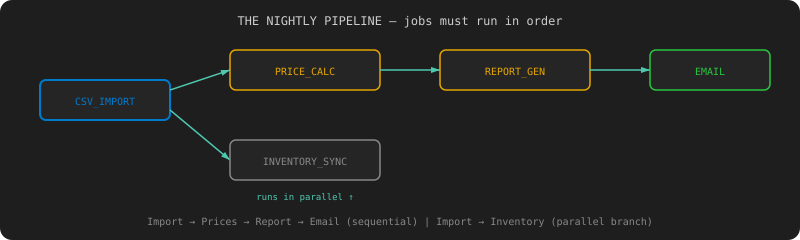

# Chapter 5: The Dependency Web — DAG Execution

[← Chapter 4: The Big Red Button](chapter-04-pause-resume-cancel.md) | [Chapter 6: The Clone Wars →](chapter-06-multiple-instances.md)

---

## The Incident

Thursday. Captain Deadline calls a meeting.

"We need a nightly pipeline. Every night at midnight: import the day's orders, recalculate prices, generate the sales report, email it to stakeholders. In that order. Automatically."

Mrs. Jira creates one ticket. It has 47 subtasks.

Right now, someone manually watches the CSV import finish, then submits the price calculation, then waits for that, then submits the report, then the email. That someone is you. At midnight. Every night.

You need jobs that know about each other. Job B shouldn't start until Job A finishes. Job C shouldn't start until Job B finishes. And if Job A fails, everything downstream should stop — not run on garbage data.



## Dependencies: "Run B After A"

### The Test

```java
@Test
void dependentJob_shouldWaitForUpstream() {
    Job csvImport = jobRepository.save(new Job("CSV_IMPORT",
        "{\"file\": \"orders.csv\"}"));
    Job priceCalc = jobRepository.save(new Job("PRICE_CALCULATION", "{}",
        DependsOn.of(csvImport.getId())));

    // Price calc should be BLOCKED while import runs
    Thread.sleep(1000);
    assertEquals(JobStatus.BLOCKED,
        jobRepository.findById(priceCalc.getId()).orElseThrow().getStatus());

    // After import completes, price calc starts automatically
    await().atMost(20, SECONDS).untilAsserted(() ->
        assertEquals(JobStatus.COMPLETED,
            jobRepository.findById(priceCalc.getId()).orElseThrow().getStatus()));
}
```

### The Fix

Add `dependsOn` to the Job entity — a list of job IDs that must complete first. New status: `BLOCKED`.

When a job completes, the engine checks: "Did this unblock any downstream jobs?"

```java
private void onJobCompleted(Job job) {
    List<Job> downstream = jobRepository.findByDependsOnContaining(job.getId());
    for (Job dep : downstream) {
        boolean allDepsComplete = dep.getDependsOn().stream()
            .map(id -> jobRepository.findById(id).orElseThrow())
            .allMatch(j -> j.getStatus() == JobStatus.COMPLETED);
        if (allDepsComplete) {
            dep.transitionTo(JobStatus.BLOCKED, JobStatus.PENDING);
            jobRepository.save(dep);
        }
    }
}
```

## Cycle Detection: "You Invented a Deadlock"

Old Greg reviews your PR. "What if A depends on B, B depends on C, and C depends on A?"

You: "Then... they all wait forever."

Old Greg: "Congratulations, you invented a deadlock."

### The Test

```java
@Test
void cyclicDependency_shouldBeRejected() {
    assertThrows(CyclicDependencyException.class, () ->
        workflowService.submit(List.of(
            new WorkflowJob("A", "CSV_IMPORT", "{}", List.of("C")),
            new WorkflowJob("B", "PRICE_CALCULATION", "{}", List.of("A")),
            new WorkflowJob("C", "REPORT_GENERATION", "{}", List.of("B"))
        )));
}
```

### The Fix: Kahn's Algorithm

Topological sort on submission. If you can't sort all nodes, there's a cycle.

```java
public static void validateNoCycles(List<WorkflowJob> jobs) {
    Map<String, Integer> inDegree = new HashMap<>();
    Map<String, List<String>> graph = new HashMap<>();

    for (WorkflowJob job : jobs) {
        inDegree.putIfAbsent(job.name(), 0);
        for (String dep : job.dependsOn()) {
            graph.computeIfAbsent(dep, k -> new ArrayList<>()).add(job.name());
            inDegree.merge(job.name(), 1, Integer::sum);
        }
    }

    Queue<String> queue = inDegree.entrySet().stream()
        .filter(e -> e.getValue() == 0)
        .map(Map.Entry::getKey)
        .collect(Collectors.toCollection(LinkedList::new));

    int sorted = 0;
    while (!queue.isEmpty()) {
        String node = queue.poll();
        sorted++;
        for (String neighbor : graph.getOrDefault(node, List.of())) {
            if (inDegree.merge(neighbor, -1, Integer::sum) == 0) {
                queue.add(neighbor);
            }
        }
    }

    if (sorted != jobs.size()) {
        throw new CyclicDependencyException("Cycle detected in workflow");
    }
}
```

A→B→C→A gets rejected with a clear error. No deadlocks.

## Workflow Submission: The Nightly Pipeline

### The Test

```java
@Test
void nightlyPipeline_shouldExecuteInCorrectOrder() {
    Workflow wf = workflowService.submit(List.of(
        new WorkflowJob("import", "CSV_IMPORT", "{\"file\":\"orders.csv\"}", List.of()),
        new WorkflowJob("prices", "PRICE_CALCULATION", "{}", List.of("import")),
        new WorkflowJob("report", "REPORT_GENERATION", "{}", List.of("prices")),
        new WorkflowJob("email", "EMAIL_DISPATCH", "{}", List.of("report")),
        new WorkflowJob("inventory", "INVENTORY_SYNC", "{}", List.of("import"))
    ));

    await().atMost(60, SECONDS).untilAsserted(() ->
        assertEquals(WorkflowStatus.COMPLETED,
            workflowRepository.findById(wf.getId()).orElseThrow().getStatus()));

    // Prices started after import finished
    Job prices = findJob(wf, "prices");
    Job imp = findJob(wf, "import");
    assertTrue(prices.getStartedAt().isAfter(imp.getCompletedAt()));

    // Inventory ran in parallel with prices (both depend only on import)
    Job inventory = findJob(wf, "inventory");
    assertTrue(inventory.getStartedAt().isBefore(prices.getCompletedAt()));
}
```

```bash
curl -X POST http://localhost:8080/workflows \
  -H "Content-Type: application/json" \
  -d '{
    "jobs": [
      {"name":"import","type":"CSV_IMPORT","payload":"{}","dependsOn":[]},
      {"name":"prices","type":"PRICE_CALCULATION","payload":"{}","dependsOn":["import"]},
      {"name":"report","type":"REPORT_GENERATION","payload":"{}","dependsOn":["prices"]},
      {"name":"email","type":"EMAIL_DISPATCH","payload":"{}","dependsOn":["report"]},
      {"name":"inventory","type":"INVENTORY_SYNC","payload":"{}","dependsOn":["import"]}
    ]
  }'

# Query the DAG
curl http://localhost:8080/workflows/wf-001/dag
```

Import runs first. Prices and inventory run in parallel (both depend only on import). Report waits for prices. Email waits for report.

You set up a cron trigger at midnight. Captain Deadline sleeps through the night for the first time in months.

## Cascade Failure: "Don't Run on Garbage"

The CSV import fails. Should the price calculation still run? No — it has no data. Should the report still generate? No — it has no prices. The whole downstream chain should stop.

### The Test

```java
@Test
void cascadeFailure_shouldCancelDownstream() {
    Workflow wf = workflowService.submit(List.of(
        new WorkflowJob("import", "CSV_IMPORT", "{\"file\":\"bad.csv\"}", List.of()),
        new WorkflowJob("prices", "PRICE_CALCULATION", "{}", List.of("import")),
        new WorkflowJob("report", "REPORT_GENERATION", "{}", List.of("prices"))
    ), FailureStrategy.CANCEL_DOWNSTREAM);

    await().atMost(15, SECONDS).untilAsserted(() -> {
        assertEquals(JobStatus.DEAD, findJob(wf, "import").getStatus());
        assertEquals(JobStatus.CANCELLED, findJob(wf, "prices").getStatus());
        assertEquals(JobStatus.CANCELLED, findJob(wf, "report").getStatus());
    });
}
```

Three strategies: `CANCEL_DOWNSTREAM` (fail fast), `CONTINUE` (run what you can), `PAUSE_DOWNSTREAM` (wait for human decision).

## What You Learned

- **DAGs** — modeling job dependencies as directed acyclic graphs
- **Topological sort** — Kahn's algorithm for execution ordering
- **Cycle detection** — rejecting circular dependencies before they deadlock
- **Cascade failure** — propagating failures downstream
- **Workflow orchestration** — submitting and tracking a pipeline as one unit

The nightly pipeline runs automatically. You stop waking up at midnight.

Next chapter: Silent Bob deploys 3 copies of your engine, and they all grab the same job.

---

[← Chapter 4: The Big Red Button](chapter-04-pause-resume-cancel.md) | [Chapter 6: The Clone Wars →](chapter-06-multiple-instances.md)
