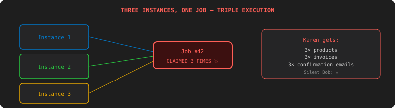

# Chapter 6: The Clone Wars — Multiple Instances

[← Chapter 5: The Dependency Web](chapter-05-dag-execution.md) | [Chapter 7: The War Room Screen →](chapter-07-real-time-api.md)

---

## The Incident

Friday. Silent Bob deploys 3 copies of your engine behind a load balancer. More instances = more throughput. Makes sense.

Except all 3 instances poll the same database. All 3 grab the same job. All 3 run it. Karen gets three copies of every product. Three invoices. Three confirmation emails.

Silent Bob sends 💀.



You already fixed this within a single JVM using `SELECT FOR UPDATE SKIP LOCKED` in Chapter 2. But that was threads sharing a connection pool. Now it's separate JVM processes with separate connection pools. Does the fix still work?

Yes. `FOR UPDATE SKIP LOCKED` is a Postgres row-level lock — it works across any number of connections, from any number of processes. The fix from Chapter 2 scales to Chapter 6 for free.

But there are new problems.

## Leader Election: "Only One Scheduler"

The DAG scheduler from Chapter 5 runs on a `@Scheduled` timer. With 3 instances, you have 3 schedulers all trying to unblock downstream jobs. Three instances detect the same stalled job and all reset it. Three instances run the nightly pipeline trigger.

Only one instance should run the scheduler. The others should be standby.

### The Test

```java
@Test
void leaderElection_shouldFailoverWhenLeaderDies() {
    LeaderElector e1 = new LeaderElector("worker-1", redisTemplate);
    LeaderElector e2 = new LeaderElector("worker-2", redisTemplate);
    e1.start(); e2.start();

    await().atMost(5, SECONDS).untilAsserted(() ->
        assertTrue(e1.isLeader() || e2.isLeader()));
    assertFalse(e1.isLeader() && e2.isLeader());

    // Kill the leader
    LeaderElector leader = e1.isLeader() ? e1 : e2;
    LeaderElector standby = e1.isLeader() ? e2 : e1;
    leader.stop();

    // Standby takes over
    await().atMost(35, SECONDS).untilAsserted(() ->
        assertTrue(standby.isLeader()));
}
```

### The Fix: Redis Lease

```java
@Component
public class LeaderElector {
    private final StringRedisTemplate redis;
    private final String instanceId;
    private volatile boolean leader = false;

    @Scheduled(fixedRate = 10_000)
    public void tryAcquire() {
        Boolean acquired = redis.opsForValue()
            .setIfAbsent("jobengine:leader", instanceId, Duration.ofSeconds(30));
        if (Boolean.TRUE.equals(acquired)) {
            leader = true;
        } else {
            String current = redis.opsForValue().get("jobengine:leader");
            leader = instanceId.equals(current);
            if (leader) {
                redis.expire("jobengine:leader", Duration.ofSeconds(30));
            }
        }
    }

    public boolean isLeader() { return leader; }
}
```

`SET NX EX 30` — set only if not exists, expire after 30 seconds. The leader renews every 10 seconds. If it dies, the key expires and another instance grabs it.

The scheduler only runs on the leader:

```java
@Scheduled(fixedRate = 5000)
public void scheduleDag() {
    if (!leaderElector.isLeader()) return;
    // ... unblock downstream jobs, detect stalled jobs
}
```

## Worker Registration

Silent Bob: "Which instance is doing what?" (He actually typed this. In Slack. Everyone was shocked.)

### The Test

```java
@Test
void workerRegistration_shouldTrackActiveInstances() {
    registry.register("worker-1", WorkerInfo.of(5, "cpu-heavy"));
    registry.register("worker-2", WorkerInfo.of(10, "general"));

    assertEquals(2, registry.getActiveWorkers().size());

    registry.expireHeartbeat("worker-1");
    assertEquals(1, registry.getActiveWorkers().size());
}
```

### The Fix

Each instance registers in Redis on startup with a heartbeat TTL:

```java
@Scheduled(fixedRate = 15_000)
public void heartbeat() {
    redis.opsForHash().put("jobengine:workers", instanceId,
        objectMapper.writeValueAsString(new WorkerInfo(poolSize, activeCount.get(), tags)));
    redis.expire("jobengine:workers:" + instanceId, Duration.ofSeconds(45));
}
```

```bash
curl http://localhost:8080/workers
# → [
#   {"instanceId":"worker-1","poolSize":5,"active":3,"tags":["cpu-heavy"]},
#   {"instanceId":"worker-2","poolSize":10,"active":7,"tags":["general"]}
# ]
```

## Job Affinity: "Route to the Right Worker"

`IMAGE_RESIZE` is CPU-heavy. `EMAIL_DISPATCH` is rate-limited to one sender. You don't want image resizing hogging the general workers, and you don't want two instances both sending emails (double sends).

### The Test

```java
@Test
void jobAffinity_shouldRouteToTaggedWorker() {
    registry.register("worker-cpu", WorkerInfo.of(5, "cpu-heavy"));
    registry.register("worker-general", WorkerInfo.of(10, "general"));

    Job resize = jobRepository.save(new Job("IMAGE_RESIZE", "{}",
        Affinity.tag("cpu-heavy")));

    await().atMost(10, SECONDS).untilAsserted(() ->
        assertEquals("worker-cpu",
            jobRepository.findById(resize.getId()).orElseThrow().getExecutedBy()));
}
```

### The Fix

Add `affinity` to the Job entity. The claim query filters by tag:

```sql
SELECT * FROM jobs
WHERE status = 'PENDING'
  AND (affinity_tag IS NULL OR affinity_tag = :workerTag)
ORDER BY priority ASC, created_at ASC
LIMIT 1
FOR UPDATE SKIP LOCKED
```

Jobs without an affinity tag run on any worker. Jobs with a tag only run on matching workers.

```bash
# Docker Compose: 1 API + 2 worker profiles
docker compose up -d --scale worker-cpu=1 --scale worker-general=2
```

```yaml
# docker-compose.yml
services:
  api:
    image: shopzilla/job-engine
    profiles: ["api"]
  worker-cpu:
    image: shopzilla/job-engine
    environment:
      JOBENGINE_WORKER_TAGS: cpu-heavy
      JOBENGINE_POOL_SIZE: 4
  worker-general:
    image: shopzilla/job-engine
    environment:
      JOBENGINE_WORKER_TAGS: general
      JOBENGINE_POOL_SIZE: 10
  postgres:
    image: postgres:16
  redis:
    image: redis:7
```

## What You Learned

- **`FOR UPDATE SKIP LOCKED`** scales across JVMs — no code changes needed
- **Leader election** via Redis `SET NX EX` — only one scheduler runs
- **Worker registration** — heartbeat-based health tracking
- **Job affinity** — route CPU-heavy and rate-limited jobs to specialized workers
- **Docker Compose** — multi-instance setup with the same codebase

Three containers split 50 IMAGE_RESIZE jobs evenly. The leader handles scheduling. If it dies, another takes over in 30 seconds.

Next chapter: Captain Deadline wants to see what's happening in real time. "I want to watch jobs complete. Live."

---

[← Chapter 5: The Dependency Web](chapter-05-dag-execution.md) | [Chapter 7: The War Room Screen →](chapter-07-real-time-api.md)
