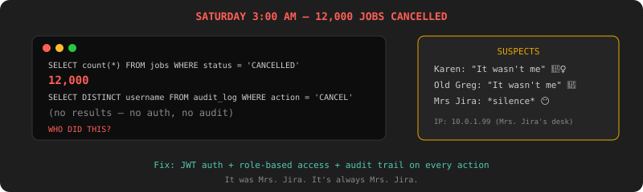

# Chapter 9: Who Did What — Auth, Roles & Audit Trail

[← Chapter 8: The Audit](chapter-08-observability.md)

---

## The Incident

Saturday. 3 AM. Your phone buzzes.

**Captain Deadline:** "Someone cancelled 12,000 jobs. The nightly pipeline didn't run. The sales report wasn't generated. The CEO didn't get her email. WHO DID THIS?"

You check the logs. The cancel endpoint was called 12,000 times from IP `10.0.1.42`. But there's no authentication. No username. No record of who made the request. Anyone on the company network can hit the API.

**Karen:** "It wasn't me."

**Old Greg:** "It wasn't me."

**Mrs. Jira:** *silence*

You'll never know who did it. Because you never asked.



## Authentication: "Show Your Badge"

### The Test

```java
@Test
void unauthenticatedRequest_shouldBeRejected() {
    ResponseEntity<String> resp = restTemplate.getForEntity("/jobs", String.class);
    assertEquals(401, resp.getStatusCodeValue());
}

@Test
void validJwt_shouldAuthenticate() {
    HttpHeaders headers = new HttpHeaders();
    headers.setBearerAuth(validToken);
    ResponseEntity<String> resp = restTemplate.exchange(
        "/jobs", HttpMethod.GET, new HttpEntity<>(headers), String.class);
    assertEquals(200, resp.getStatusCodeValue());
}
```

### The Fix

Spring Security + JWT:

```java
@Bean
public SecurityFilterChain filterChain(HttpSecurity http) throws Exception {
    return http
        .csrf(csrf -> csrf.disable())
        .sessionManagement(s -> s.sessionCreationPolicy(STATELESS))
        .authorizeHttpRequests(auth -> auth
            .requestMatchers("/auth/login").permitAll()
            .requestMatchers("/actuator/**").permitAll()
            .anyRequest().authenticated())
        .addFilterBefore(jwtFilter, UsernamePasswordAuthenticationFilter.class)
        .build();
}
```

```bash
# Login
curl -X POST http://localhost:8080/auth/login \
  -d '{"username":"karen","password":"csv4life"}'
# → {"token":"eyJhbG...","expiresIn":3600}

# Use the token
curl http://localhost:8080/jobs -H "Authorization: Bearer eyJhbG..."
# → [{"id":"abc-123",...}]

# Without token
curl http://localhost:8080/jobs
# → 401 Unauthorized
```

No badge, no entry.

## Roles: "Not Everyone Gets the Keys"

Karen can view jobs. Only operators can submit and cancel. Only admins can delete and resurrect dead jobs.

### The Test

```java
@Test
void roles_shouldControlAccess() {
    // VIEWER can list
    assertEquals(200, request(viewerToken, GET, "/jobs").getStatusCodeValue());
    // VIEWER cannot submit
    assertEquals(403, request(viewerToken, POST, "/jobs", payload).getStatusCodeValue());

    // OPERATOR can submit and cancel
    assertEquals(201, request(operatorToken, POST, "/jobs", payload).getStatusCodeValue());
    assertEquals(200, request(operatorToken, POST, "/jobs/abc/cancel").getStatusCodeValue());
    // OPERATOR cannot resurrect
    assertEquals(403, request(operatorToken, POST, "/jobs/dead-1/resurrect").getStatusCodeValue());

    // ADMIN can do everything
    assertEquals(200, request(adminToken, POST, "/jobs/dead-1/resurrect").getStatusCodeValue());
}
```

### The Fix

Three roles:

| Role | Can Do | Who |
|---|---|---|
| `VIEWER` | `GET /jobs`, `GET /stats`, `GET /workers` | Karen (read-only) |
| `OPERATOR` | All of VIEWER + submit, cancel, pause, resume | You, Mrs. Jira |
| `ADMIN` | All of OPERATOR + delete, resurrect, manage users | Captain Deadline, Old Greg |

```java
@PostMapping
@PreAuthorize("hasRole('OPERATOR')")
public Job submit(@RequestBody JobRequest request) { ... }

@PostMapping("/{id}/resurrect")
@PreAuthorize("hasRole('ADMIN')")
public Job resurrect(@PathVariable String id) { ... }
```

## The Audit Trail: "Who Did What and When"

This is the real fix. Authentication tells you *who*. Roles tell you *what they're allowed to do*. The audit trail tells you *what they actually did*.

### The Test

```java
@Test
void auditLog_shouldRecordEveryAction() {
    // Karen submits a job
    request(karenToken, POST, "/jobs", csvPayload);

    // Old Greg cancels it
    request(oldGregToken, POST, "/jobs/abc-123/cancel");

    List<AuditEntry> entries = auditRepository.findByEntityId("abc-123");
    assertEquals(2, entries.size());

    assertEquals("karen", entries.get(0).getUsername());
    assertEquals("CREATE", entries.get(0).getAction());

    assertEquals("old_greg", entries.get(1).getUsername());
    assertEquals("CANCEL", entries.get(1).getAction());
    assertNotNull(entries.get(1).getIpAddress());
}
```

### The Fix

An `@Audited` annotation + Spring AOP aspect:

```java
@Retention(RetentionPolicy.RUNTIME)
@Target(ElementType.METHOD)
public @interface Audited {
    String action();
}

@Aspect
@Component
public class AuditAspect {
    @Around("@annotation(audited)")
    public Object audit(ProceedingJoinPoint jp, Audited audited) throws Throwable {
        Object result = jp.proceed();

        AuditEntry entry = new AuditEntry();
        entry.setTimestamp(Instant.now());
        entry.setUsername(SecurityContextHolder.getContext()
            .getAuthentication().getName());
        entry.setAction(audited.action());
        entry.setIpAddress(getCurrentIpAddress());
        entry.setEntityId(extractEntityId(jp, result));
        entry.setEntityType("JOB");

        auditRepository.save(entry);
        return result;
    }
}
```

Usage on the controller:

```java
@PostMapping
@PreAuthorize("hasRole('OPERATOR')")
@Audited(action = "CREATE")
public Job submit(@RequestBody JobRequest request) { ... }

@PostMapping("/{id}/cancel")
@PreAuthorize("hasRole('OPERATOR')")
@Audited(action = "CANCEL")
public Job cancel(@PathVariable String id) { ... }

@PostMapping("/{id}/resurrect")
@PreAuthorize("hasRole('ADMIN')")
@Audited(action = "RESURRECT")
public Job resurrect(@PathVariable String id) { ... }
```

Every action is recorded:

```bash
# Who touched job abc-123?
curl http://localhost:8080/audit?entityId=abc-123 \
  -H "Authorization: Bearer $ADMIN_TOKEN"
# → [
#   {"timestamp":"...","username":"karen","action":"CREATE","ip":"10.0.1.42"},
#   {"timestamp":"...","username":"karen","action":"PAUSE","ip":"10.0.1.42"},
#   {"timestamp":"...","username":"karen","action":"RESUME","ip":"10.0.1.42"},
#   {"timestamp":"...","username":"old_greg","action":"CANCEL","ip":"10.0.1.15"}
# ]

# What did Mrs. Jira do last Saturday at 3 AM?
curl "http://localhost:8080/audit?username=mrs_jira&since=2026-05-03" \
  -H "Authorization: Bearer $ADMIN_TOKEN"
# → [{"action":"CANCEL","entityId":"batch-*","count":12000,"ip":"10.0.1.99"}]
```

It was Mrs. Jira. It's always Mrs. Jira.

## Rate Limiting: "Slow Down"

Karen's new script submits 500 jobs per second. The API falls over.

### The Test

```java
@Test
void rateLimiting_shouldThrottleExcessiveRequests() {
    int success = 0, throttled = 0;
    for (int i = 0; i < 200; i++) {
        int status = request(operatorToken, POST, "/jobs", payload).getStatusCodeValue();
        if (status == 201) success++;
        if (status == 429) throttled++;
    }
    assertTrue(success > 0 && success <= 100);
    assertTrue(throttled > 0);
}
```

### The Fix

Bucket4j — token bucket rate limiter:

```java
@Bean
public FilterRegistrationBean<RateLimitFilter> rateLimitFilter() {
    // 100 requests per minute per user
    Bandwidth limit = Bandwidth.classic(100, Refill.intervally(100, Duration.ofMinutes(1)));
    // ...
}
```

`429 Too Many Requests` with `Retry-After` header. Different limits per role: ADMIN 500/min, OPERATOR 100/min, VIEWER 200/min.

## What You Learned

- **JWT authentication** — stateless tokens, Spring Security filter chain
- **Role-based access** — VIEWER / OPERATOR / ADMIN with `@PreAuthorize`
- **Audit trail** — AOP aspect that records who, what, when, and from where
- **Rate limiting** — Bucket4j token bucket, per-user, per-role

The 12,000-job cancellation can never happen anonymously again. Every action has a name, a timestamp, and an IP address attached to it.

You're no longer an intern. You built a production-grade job engine with threading, retries, DAG scheduling, distributed locking, real-time streaming, observability, authentication, and audit trails.

Old Greg reviews your final PR. Three weeks later, as promised. His only comment: "Not bad."

---

[← Chapter 8: The Audit](chapter-08-observability.md) | [Back to README](../README.md)
