# Chapter 55: Mermaid.js — Diagrams as Code

## What you'll learn

- What Mermaid is and where to use it (GitHub, Notion, MDX, docs)
- Flowcharts: decision trees, processes, algorithms
- Sequence diagrams: API calls, service interactions
- Class diagrams: OOP design, entity relationships
- Entity-Relationship diagrams: database schemas
- State diagrams: state machines, UI flows
- Gantt charts: project timelines
- Git graphs: branching strategies
- Pie charts, mindmaps, and more
- Styling and theming

---

## PART 1: Getting Started

## 55.1 What is Mermaid?

Mermaid is a JavaScript library that renders diagrams from text. Write code, get a diagram. No drag-and-drop, no image editing.

```
WRITE THIS:                          GET THIS:
                                     ┌───────┐     ┌───────┐
graph LR                             │   A   │────►│   B   │
  A --> B --> C                       └───────┘     └───┬───┘
                                                       │
                                                  ┌────▼────┐
                                                  │    C    │
                                                  └─────────┘
```

**Where it works:**
- GitHub Markdown (README, issues, PRs, wikis) — native support
- GitLab Markdown
- Notion
- Obsidian
- MDX/Next.js (with rehype plugin or component)
- VS Code (preview extension)
- Confluence (with plugin)
- Any HTML page (include mermaid.js script)

## 55.2 Using Mermaid

**In GitHub/GitLab Markdown:**
````markdown
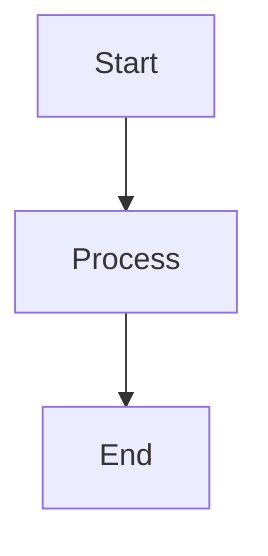
```mermaid
graph TD
  A[Start] --> B[Process]
  B --> C[End]
```
````

**In HTML:**
```html
<script src="https://cdn.jsdelivr.net/npm/mermaid/dist/mermaid.min.js"></script>
<pre class="mermaid">
graph TD
  A[Start] --> B[Process]
  B --> C[End]
</pre>
<script>mermaid.initialize({ startOnLoad: true });</script>
```

**In Next.js/MDX:**
```bash
npm install mermaid
```
```tsx
"use client";
import { useEffect, useRef } from "react";
import mermaid from "mermaid";

export function MermaidDiagram({ chart }: { chart: string }) {
  const ref = useRef<HTMLDivElement>(null);

  useEffect(() => {
    mermaid.initialize({ startOnLoad: false, theme: "dark" });
    mermaid.run({ nodes: [ref.current!] });
  }, [chart]);

  return <div ref={ref} className="mermaid">{chart}</div>;
}
```

**Live editor:** [mermaid.live](https://mermaid.live) — best for experimenting.

---

## PART 2: Flowcharts

## 55.3 Basic flowchart

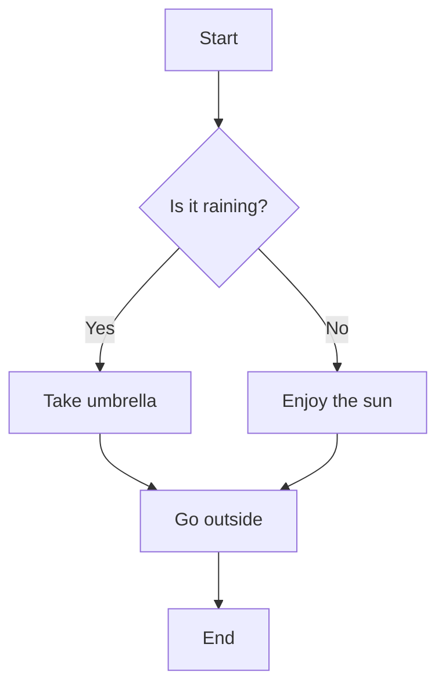
```mermaid
graph TD
  A[Start] --> B{Is it raining?}
  B -->|Yes| C[Take umbrella]
  B -->|No| D[Enjoy the sun]
  C --> E[Go outside]
  D --> E
  E --> F[End]
```

**Syntax:**
```
graph TD          ← Top-Down direction (TD, LR, BT, RL)

Node shapes:
  A[Rectangle]    ← square corners
  B(Rounded)      ← rounded corners
  C{Diamond}      ← decision/condition
  D([Stadium])    ← rounded ends (terminal)
  E[[Subroutine]] ← double borders
  F[(Database)]   ← cylinder shape
  G((Circle))     ← circle
  H>Flag]         ← asymmetric

Arrows:
  A --> B         ← solid arrow
  A --- B         ← solid line (no arrow)
  A -.-> B        ← dotted arrow
  A ==> B         ← thick arrow
  A -->|label| B  ← arrow with text
  A -- text --- B ← line with text
```

## 55.4 Algorithm flowchart (Binary Search)

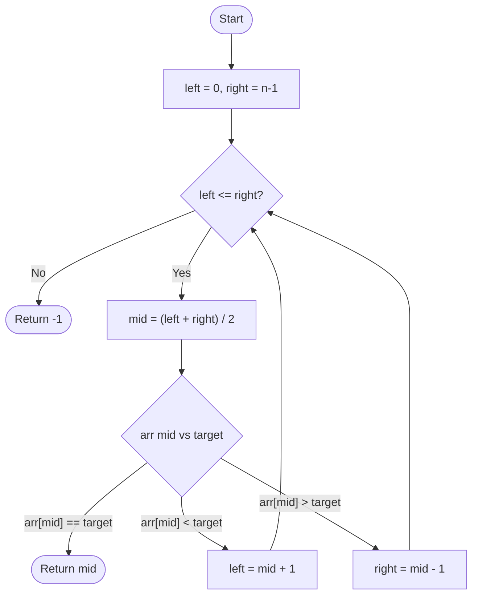
```mermaid
graph TD
  Start([Start]) --> Init["left = 0, right = n-1"]
  Init --> Check{left <= right?}
  Check -->|No| NotFound([Return -1])
  Check -->|Yes| CalcMid["mid = (left + right) / 2"]
  CalcMid --> Compare{arr mid vs target}
  Compare -->|"arr[mid] == target"| Found([Return mid])
  Compare -->|"arr[mid] < target"| GoRight["left = mid + 1"]
  Compare -->|"arr[mid] > target"| GoLeft["right = mid - 1"]
  GoRight --> Check
  GoLeft --> Check
```

## 55.5 System architecture flowchart

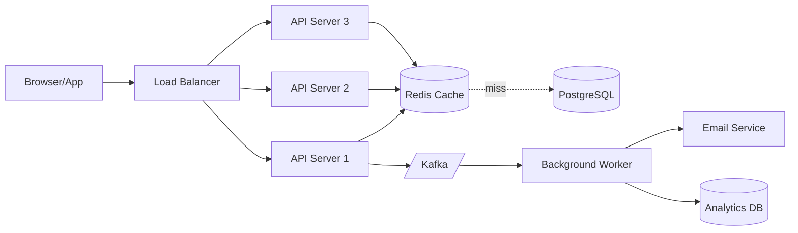
```mermaid
graph LR
  Client[Browser/App] --> LB[Load Balancer]
  LB --> API1[API Server 1]
  LB --> API2[API Server 2]
  LB --> API3[API Server 3]
  API1 --> Cache[(Redis Cache)]
  API2 --> Cache
  API3 --> Cache
  Cache -.->|miss| DB[(PostgreSQL)]
  API1 --> Queue[/Kafka/]
  Queue --> Worker[Background Worker]
  Worker --> Email[Email Service]
  Worker --> Analytics[(Analytics DB)]
```

## 55.6 Subgraphs (grouping)

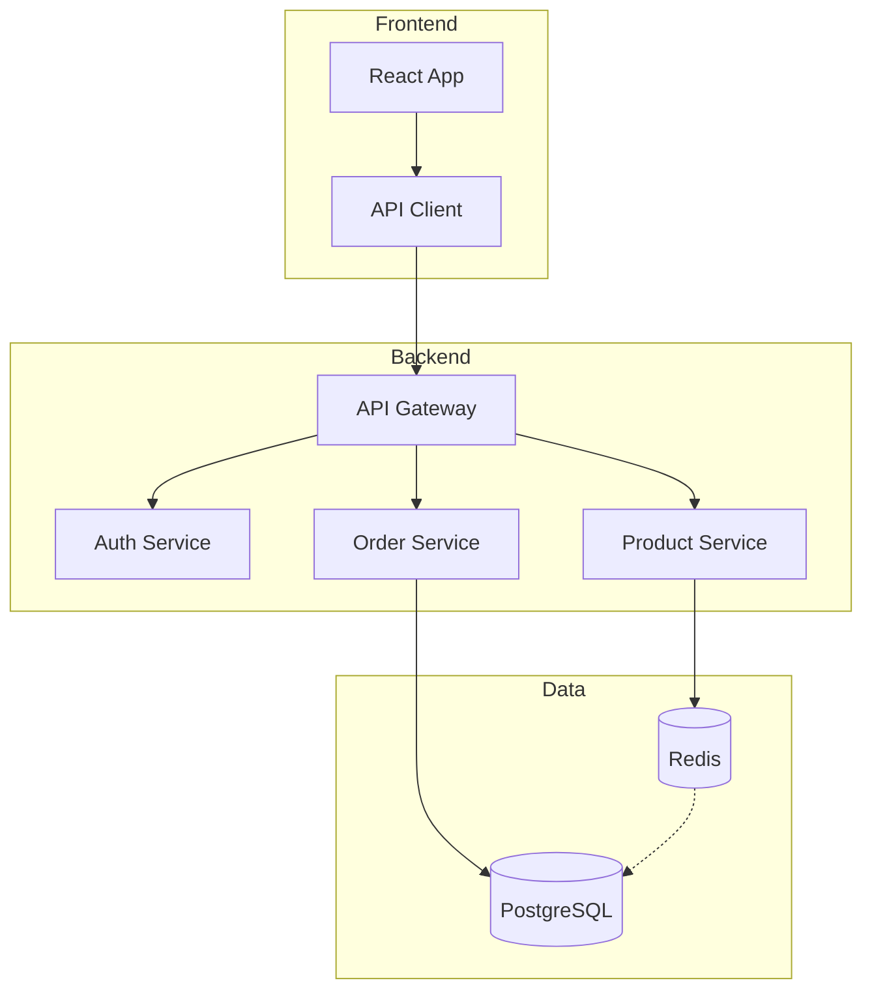
```mermaid
graph TB
  subgraph Frontend
    UI[React App] --> API_Call[API Client]
  end

  subgraph Backend
    Gateway[API Gateway] --> Auth[Auth Service]
    Gateway --> Orders[Order Service]
    Gateway --> Products[Product Service]
  end

  subgraph Data
    Orders --> DB[(PostgreSQL)]
    Products --> Cache[(Redis)]
    Cache -.-> DB
  end

  API_Call --> Gateway
```

---

## PART 3: Sequence Diagrams

## 55.7 Basic sequence diagram

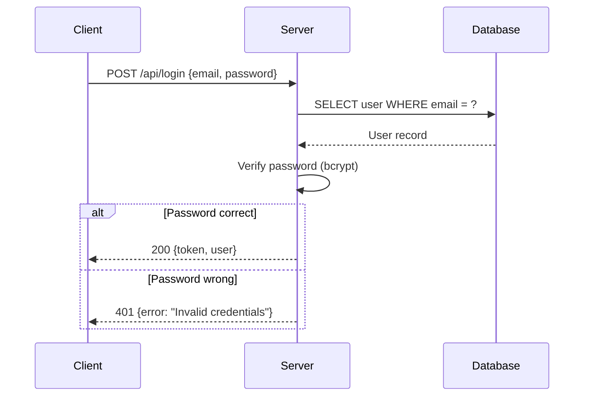
```mermaid
sequenceDiagram
  participant C as Client
  participant S as Server
  participant DB as Database

  C->>S: POST /api/login {email, password}
  S->>DB: SELECT user WHERE email = ?
  DB-->>S: User record
  S->>S: Verify password (bcrypt)
  alt Password correct
    S-->>C: 200 {token, user}
  else Password wrong
    S-->>C: 401 {error: "Invalid credentials"}
  end
```

**Syntax:**
```
Arrows:
  A->>B     solid arrow (request)
  A-->>B    dashed arrow (response)
  A-xB      cross at end (failed/rejected)
  A-)B      async (open arrowhead)

Blocks:
  alt/else/end      ← conditional
  loop/end          ← repetition
  opt/end           ← optional
  par/and/end       ← parallel
  Note over A,B: text  ← annotation
  activate A / deactivate A  ← lifeline activation
```

## 55.8 JWT authentication flow

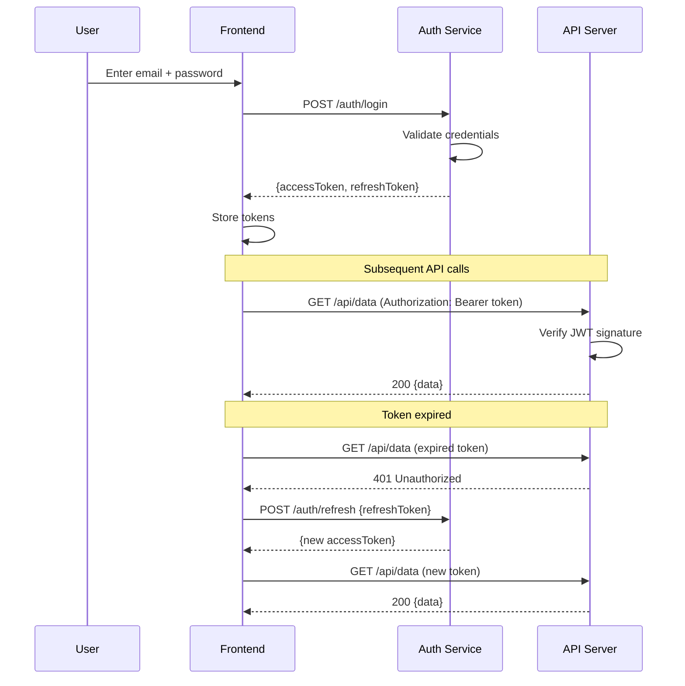
```mermaid
sequenceDiagram
  participant U as User
  participant F as Frontend
  participant A as Auth Service
  participant API as API Server

  U->>F: Enter email + password
  F->>A: POST /auth/login
  A->>A: Validate credentials
  A-->>F: {accessToken, refreshToken}
  F->>F: Store tokens

  Note over F,API: Subsequent API calls

  F->>API: GET /api/data (Authorization: Bearer token)
  API->>API: Verify JWT signature
  API-->>F: 200 {data}

  Note over F,API: Token expired

  F->>API: GET /api/data (expired token)
  API-->>F: 401 Unauthorized
  F->>A: POST /auth/refresh {refreshToken}
  A-->>F: {new accessToken}
  F->>API: GET /api/data (new token)
  API-->>F: 200 {data}
```

## 55.9 Microservice interaction

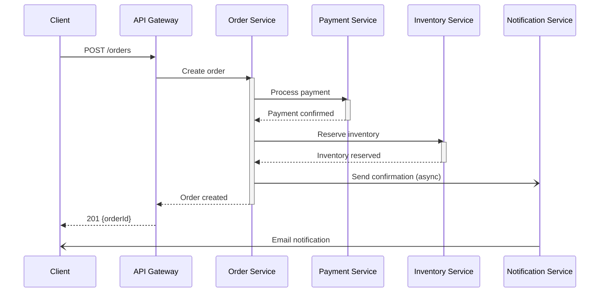
```mermaid
sequenceDiagram
  participant C as Client
  participant GW as API Gateway
  participant OS as Order Service
  participant PS as Payment Service
  participant IS as Inventory Service
  participant NS as Notification Service

  C->>GW: POST /orders
  GW->>OS: Create order
  activate OS
  OS->>PS: Process payment
  activate PS
  PS-->>OS: Payment confirmed
  deactivate PS
  OS->>IS: Reserve inventory
  activate IS
  IS-->>OS: Inventory reserved
  deactivate IS
  OS-)NS: Send confirmation (async)
  OS-->>GW: Order created
  deactivate OS
  GW-->>C: 201 {orderId}
  NS-)C: Email notification
```

---

## PART 4: Class Diagrams

## 55.10 Basic class diagram

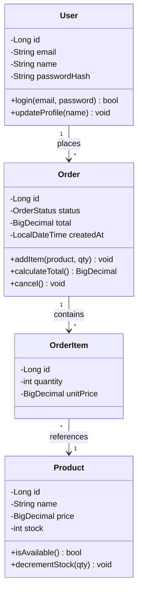
```mermaid
classDiagram
  class User {
    -Long id
    -String email
    -String name
    -String passwordHash
    +login(email, password) bool
    +updateProfile(name) void
  }

  class Order {
    -Long id
    -OrderStatus status
    -BigDecimal total
    -LocalDateTime createdAt
    +addItem(product, qty) void
    +calculateTotal() BigDecimal
    +cancel() void
  }

  class Product {
    -Long id
    -String name
    -BigDecimal price
    -int stock
    +isAvailable() bool
    +decrementStock(qty) void
  }

  class OrderItem {
    -Long id
    -int quantity
    -BigDecimal unitPrice
  }

  User "1" --> "*" Order : places
  Order "1" --> "*" OrderItem : contains
  OrderItem "*" --> "1" Product : references
```

**Syntax:**
```
Visibility:
  + public
  - private
  # protected
  ~ package

Relationships:
  A --> B       association
  A --o B       aggregation (hollow diamond)
  A --* B       composition (filled diamond)
  A ..|> B      implementation (dashed, open triangle)
  A --|> B      inheritance (solid, open triangle)
  A ..> B       dependency (dashed arrow)

Cardinality:
  "1" --> "*"       one to many
  "1" --> "0..1"    one to zero-or-one
  "*" --> "*"       many to many
```

## 55.11 Design patterns

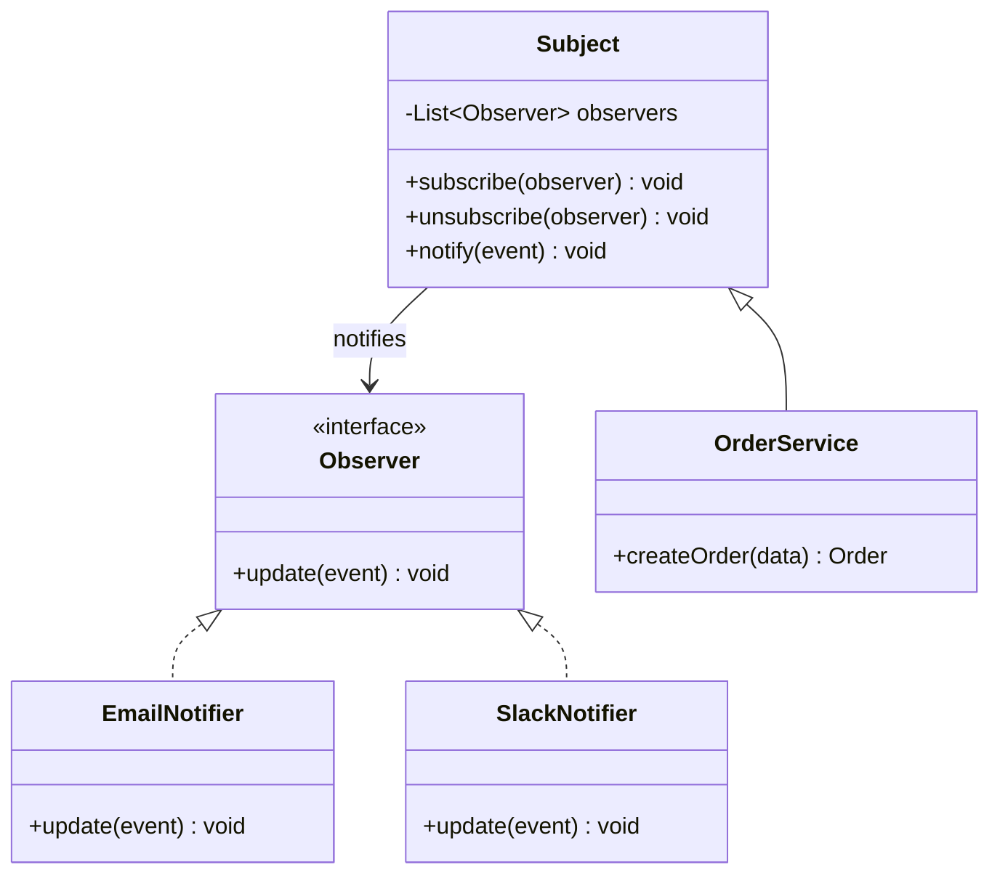
```mermaid
classDiagram
  class Observer {
    <<interface>>
    +update(event) void
  }

  class Subject {
    -List~Observer~ observers
    +subscribe(observer) void
    +unsubscribe(observer) void
    +notify(event) void
  }

  class EmailNotifier {
    +update(event) void
  }

  class SlackNotifier {
    +update(event) void
  }

  class OrderService {
    +createOrder(data) Order
  }

  Observer <|.. EmailNotifier
  Observer <|.. SlackNotifier
  Subject <|-- OrderService
  Subject --> Observer : notifies
```

---

## PART 5: Entity-Relationship Diagrams

## 55.12 Database schema

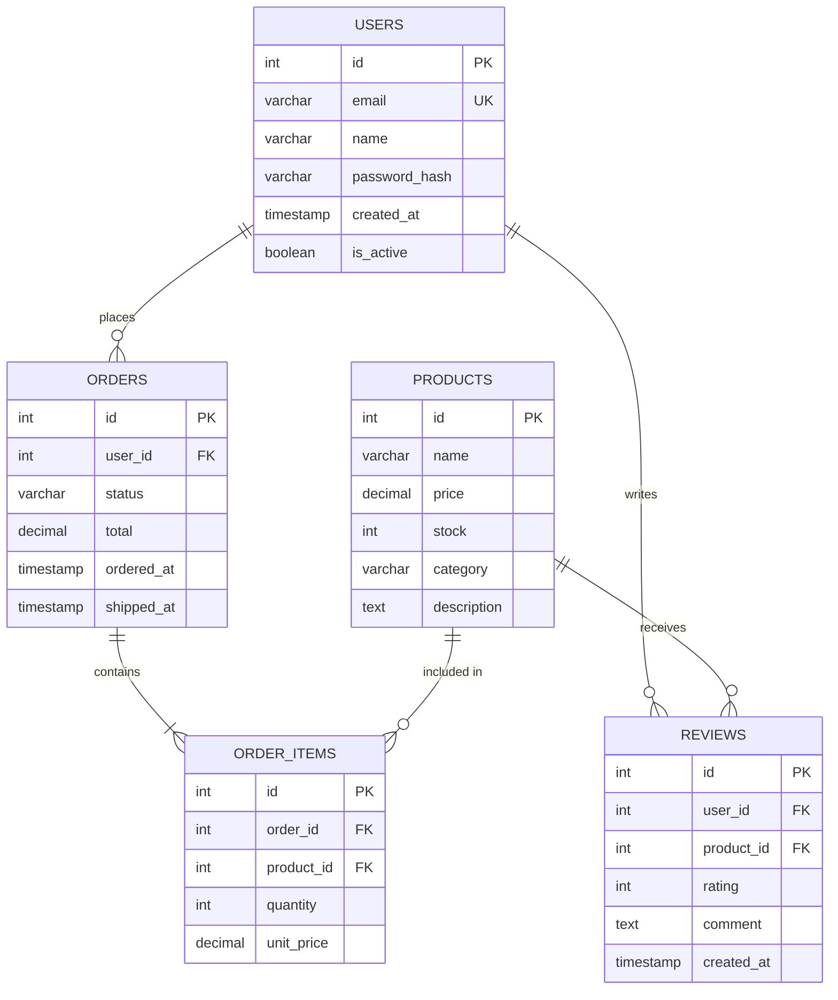
```mermaid
erDiagram
  USERS {
    int id PK
    varchar email UK
    varchar name
    varchar password_hash
    timestamp created_at
    boolean is_active
  }

  PRODUCTS {
    int id PK
    varchar name
    decimal price
    int stock
    varchar category
    text description
  }

  ORDERS {
    int id PK
    int user_id FK
    varchar status
    decimal total
    timestamp ordered_at
    timestamp shipped_at
  }

  ORDER_ITEMS {
    int id PK
    int order_id FK
    int product_id FK
    int quantity
    decimal unit_price
  }

  REVIEWS {
    int id PK
    int user_id FK
    int product_id FK
    int rating
    text comment
    timestamp created_at
  }

  USERS ||--o{ ORDERS : "places"
  ORDERS ||--|{ ORDER_ITEMS : "contains"
  PRODUCTS ||--o{ ORDER_ITEMS : "included in"
  USERS ||--o{ REVIEWS : "writes"
  PRODUCTS ||--o{ REVIEWS : "receives"
```

**Relationship syntax:**
```
||--||    one to one
||--o{    one to zero or more
||--|{    one to one or more
}o--o{    zero or more to zero or more
```

---

## PART 6: State Diagrams

## 55.13 Order state machine

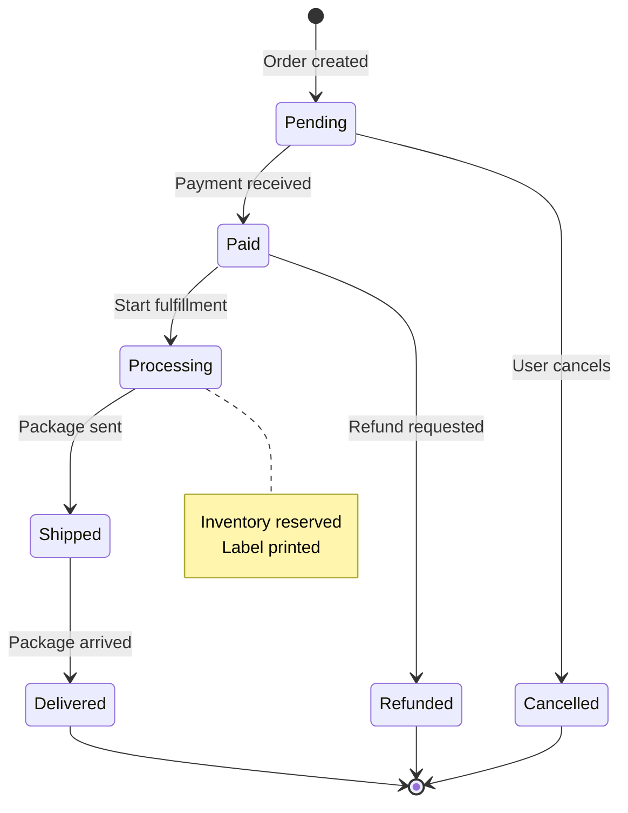
```mermaid
stateDiagram-v2
  [*] --> Pending : Order created
  Pending --> Paid : Payment received
  Pending --> Cancelled : User cancels
  Paid --> Processing : Start fulfillment
  Processing --> Shipped : Package sent
  Shipped --> Delivered : Package arrived
  Delivered --> [*]
  Cancelled --> [*]

  Paid --> Refunded : Refund requested
  Refunded --> [*]

  note right of Processing
    Inventory reserved
    Label printed
  end note
```

## 55.14 UI navigation state

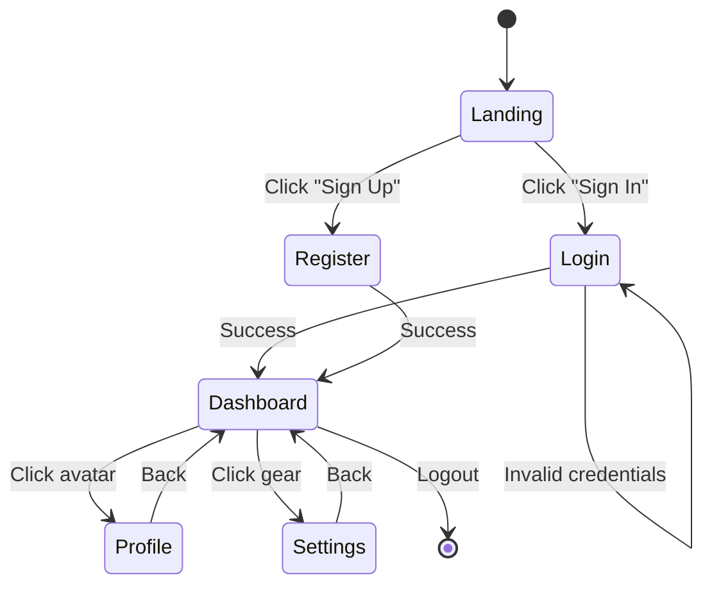
```mermaid
stateDiagram-v2
  [*] --> Landing
  Landing --> Login : Click "Sign In"
  Landing --> Register : Click "Sign Up"
  Login --> Dashboard : Success
  Login --> Login : Invalid credentials
  Register --> Dashboard : Success
  Dashboard --> Profile : Click avatar
  Dashboard --> Settings : Click gear
  Profile --> Dashboard : Back
  Settings --> Dashboard : Back
  Dashboard --> [*] : Logout
```

---

## PART 7: Gantt Charts

## 55.15 Project timeline

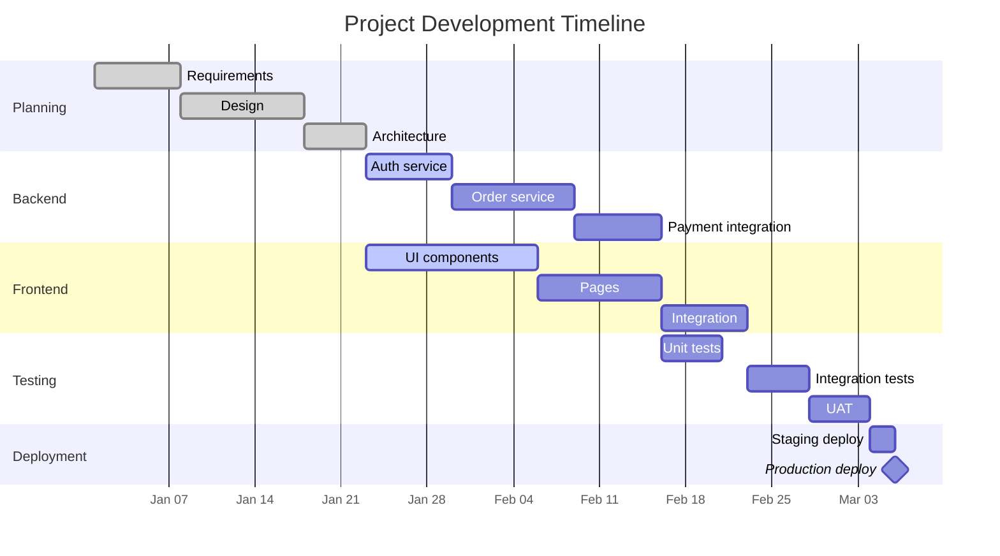
```mermaid
gantt
  title Project Development Timeline
  dateFormat YYYY-MM-DD
  axisFormat %b %d

  section Planning
    Requirements      :done, req, 2024-01-01, 7d
    Design            :done, des, after req, 10d
    Architecture      :done, arch, after des, 5d

  section Backend
    Auth service      :active, auth, 2024-01-23, 7d
    Order service     :order, after auth, 10d
    Payment integration :pay, after order, 7d

  section Frontend
    UI components     :active, ui, 2024-01-23, 14d
    Pages             :pages, after ui, 10d
    Integration       :int, after pages, 7d

  section Testing
    Unit tests        :test1, after pay, 5d
    Integration tests :test2, after int, 5d
    UAT               :uat, after test2, 5d

  section Deployment
    Staging deploy    :stage, after uat, 2d
    Production deploy :milestone, prod, after stage, 0d
```

---

## PART 8: Git Graphs

## 55.16 Git branching strategy

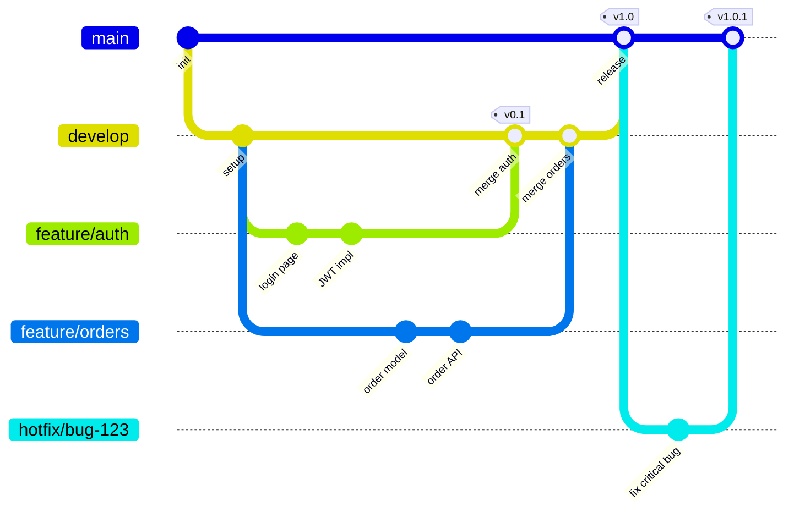
```mermaid
gitGraph
  commit id: "init"
  branch develop
  commit id: "setup"
  branch feature/auth
  commit id: "login page"
  commit id: "JWT impl"
  checkout develop
  branch feature/orders
  commit id: "order model"
  commit id: "order API"
  checkout develop
  merge feature/auth id: "merge auth" tag: "v0.1"
  merge feature/orders id: "merge orders"
  checkout main
  merge develop id: "release" tag: "v1.0"
  branch hotfix/bug-123
  commit id: "fix critical bug"
  checkout main
  merge hotfix/bug-123 tag: "v1.0.1"
```

---

## PART 9: Other Diagram Types

## 55.17 Pie chart

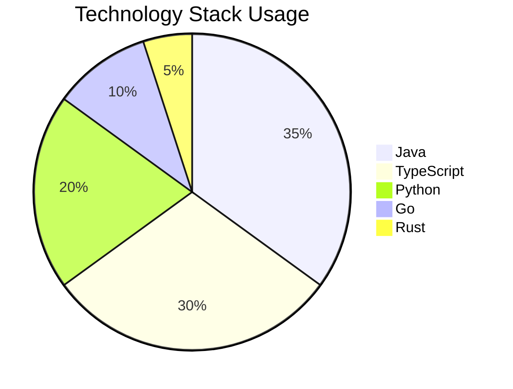
```mermaid
pie title Technology Stack Usage
  "Java" : 35
  "TypeScript" : 30
  "Python" : 20
  "Go" : 10
  "Rust" : 5
```

## 55.18 Mindmap

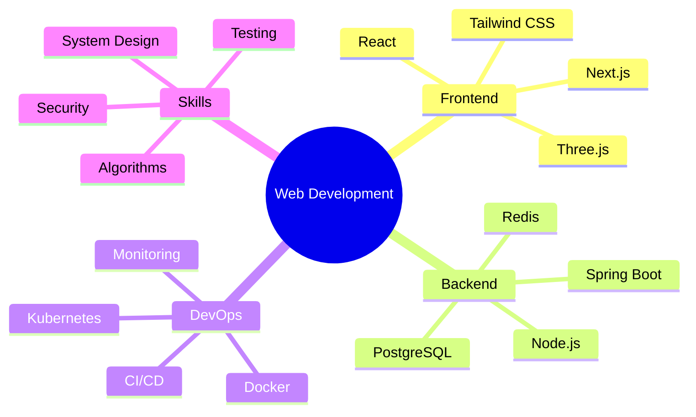
```mermaid
mindmap
  root((Web Development))
    Frontend
      React
      Next.js
      Tailwind CSS
      Three.js
    Backend
      Spring Boot
      Node.js
      PostgreSQL
      Redis
    DevOps
      Docker
      Kubernetes
      CI/CD
      Monitoring
    Skills
      System Design
      Algorithms
      Testing
      Security
```

## 55.19 Timeline

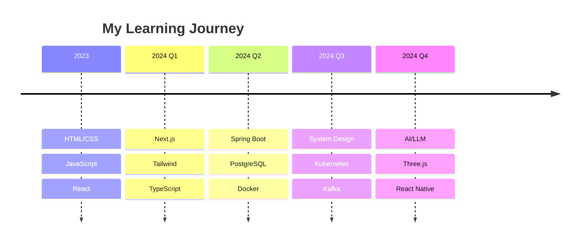
```mermaid
timeline
  title My Learning Journey
  2023 : HTML/CSS : JavaScript : React
  2024 Q1 : Next.js : Tailwind : TypeScript
  2024 Q2 : Spring Boot : PostgreSQL : Docker
  2024 Q3 : System Design : Kubernetes : Kafka
  2024 Q4 : AI/LLM : Three.js : React Native
```

## 55.20 Quadrant chart

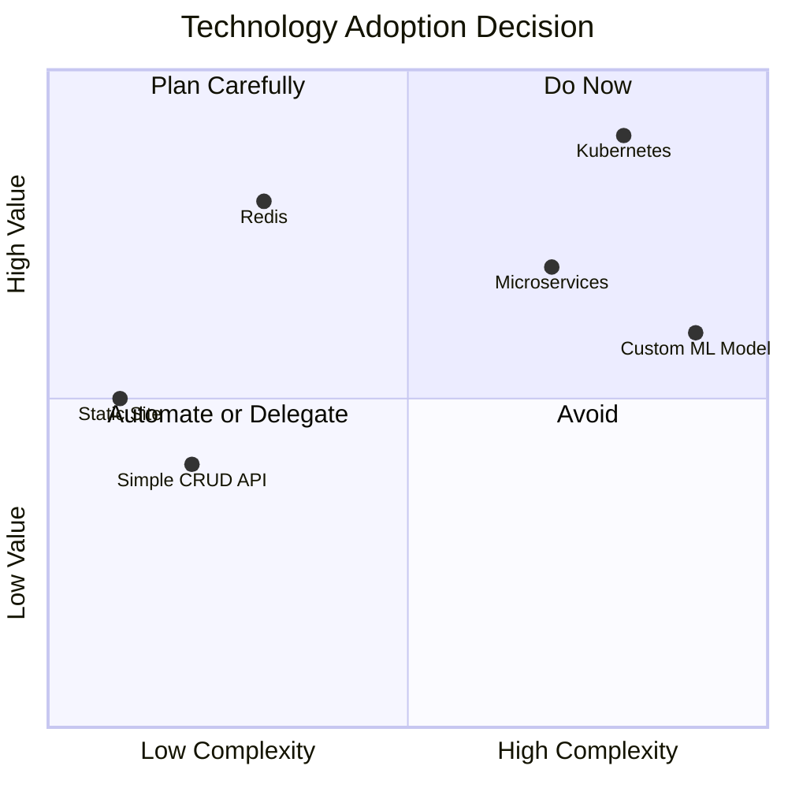
```mermaid
quadrantChart
  title Technology Adoption Decision
  x-axis Low Complexity --> High Complexity
  y-axis Low Value --> High Value
  quadrant-1 Do Now
  quadrant-2 Plan Carefully
  quadrant-3 Automate or Delegate
  quadrant-4 Avoid

  Redis: [0.3, 0.8]
  Kubernetes: [0.8, 0.9]
  Simple CRUD API: [0.2, 0.4]
  Custom ML Model: [0.9, 0.6]
  Static Site: [0.1, 0.5]
  Microservices: [0.7, 0.7]
```

---

## PART 10: Styling

## 55.21 Custom styling

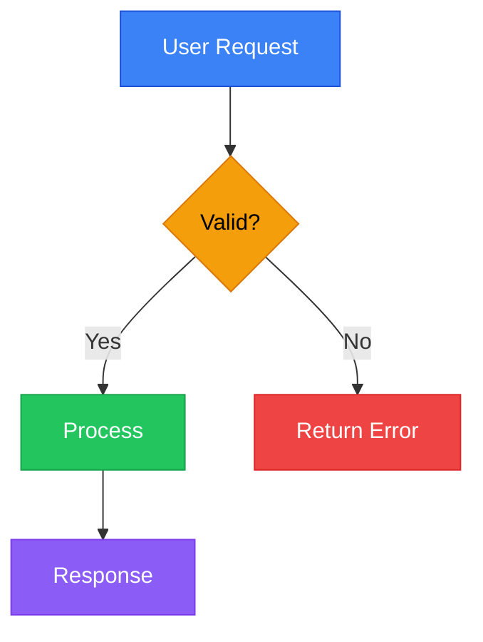
```mermaid
graph TD
  A[User Request] --> B{Valid?}
  B -->|Yes| C[Process]
  B -->|No| D[Return Error]
  C --> E[Response]

  style A fill:#3b82f6,stroke:#1d4ed8,color:#fff
  style B fill:#f59e0b,stroke:#d97706,color:#000
  style C fill:#22c55e,stroke:#16a34a,color:#fff
  style D fill:#ef4444,stroke:#dc2626,color:#fff
  style E fill:#8b5cf6,stroke:#7c3aed,color:#fff
```

```
Styling syntax:
  style NodeId fill:#hex,stroke:#hex,color:#hex,stroke-width:2px

Class-based styling:
  classDef success fill:#22c55e,stroke:#16a34a,color:#fff
  classDef error fill:#ef4444,stroke:#dc2626,color:#fff
  class C success
  class D error
```

## 55.22 Themes

```javascript
mermaid.initialize({
  theme: "dark",       // default, dark, forest, neutral, base
  themeVariables: {
    primaryColor: "#3b82f6",
    primaryTextColor: "#ffffff",
    primaryBorderColor: "#1d4ed8",
    lineColor: "#64748b",
    secondaryColor: "#1e293b",
    tertiaryColor: "#334155",
  },
});
```

---

## Quick Reference

| Diagram type | First line | Use for |
|-------------|-----------|---------|
| Flowchart | `graph TD` or `graph LR` | Processes, algorithms, architecture |
| Sequence | `sequenceDiagram` | API calls, service interactions, auth flows |
| Class | `classDiagram` | OOP design, relationships, patterns |
| ER | `erDiagram` | Database schemas, table relationships |
| State | `stateDiagram-v2` | State machines, UI flows, order status |
| Gantt | `gantt` | Project timelines, sprint planning |
| Git | `gitGraph` | Branching strategies, release flows |
| Pie | `pie` | Proportions, distributions |
| Mindmap | `mindmap` | Brainstorming, topic overview |
| Timeline | `timeline` | Historical events, learning paths |
| Quadrant | `quadrantChart` | Priority matrices, decision frameworks |

---

## Summary

✅ Flowcharts: node shapes, arrows, labels, subgraphs, decisions
✅ Sequence diagrams: requests/responses, alt/loop/par blocks, activation
✅ Class diagrams: visibility, relationships (inheritance, composition, association), cardinality
✅ ER diagrams: tables, columns, PK/FK, relationship notation
✅ State diagrams: transitions, notes, start/end states
✅ Gantt: tasks, dependencies, milestones, sections
✅ Git graphs: branches, commits, merges, tags
✅ Extras: pie, mindmap, timeline, quadrant
✅ Styling: per-node, class-based, themes

## Key takeaway

**Diagrams as code = diagrams that stay up to date.** When your architecture diagram lives in the same repo as your code (in a README or design doc), it gets updated when the code changes. A Figma/Draw.io diagram is forgotten after the first sprint. A Mermaid diagram in your PR description gets reviewed alongside the code it describes.

---

→ [Back to Chapter 54: Professional Game Dev](./54-PROFESSIONAL-GAME-DEV.md)
